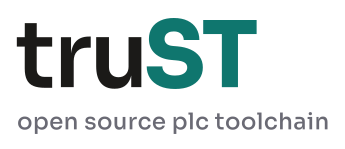
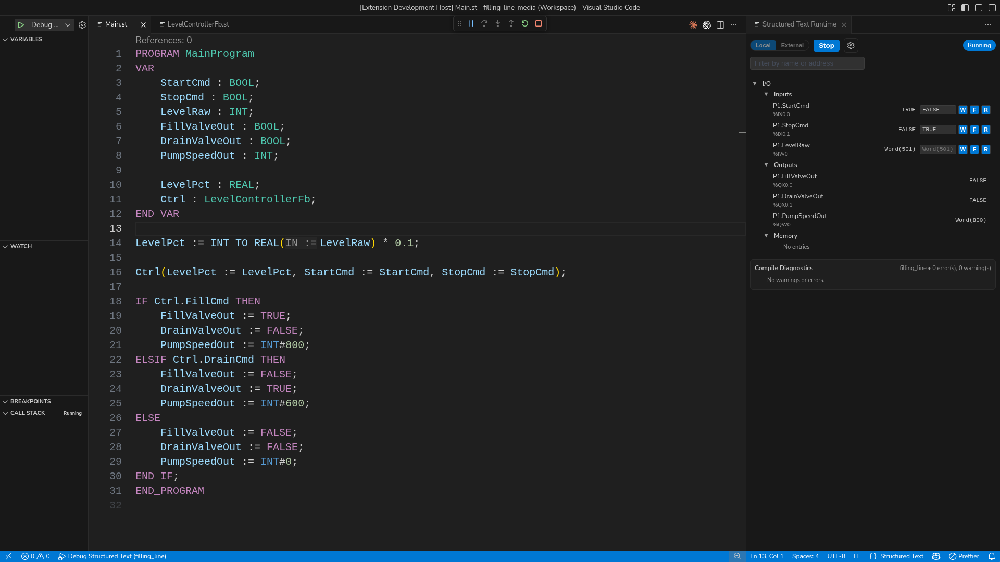

# truST — IEC 61131-3 Structured Text toolchain, runtime, and HMI



[](https://johannespettersson80.github.io/trust-platform/)
[](https://marketplace.visualstudio.com/items?itemName=trust-platform.trust-lsp)
[](https://github.com/johannesPettersson80/trust-platform/releases/latest)
[](https://github.com/johannesPettersson80/trust-platform/actions/workflows/ci.yml)
[](LICENSE-MIT)
[](Cargo.toml)

Documentation: <https://johannespettersson80.github.io/trust-platform/>

truST is an open-source IEC 61131-3 Structured Text toolchain with:

- a VS Code extension and IEC-aware language server
- a live runtime panel and `trust-debug` debugger in the editor
- `trust-runtime` for local and target execution
- browser IDE and HMI pages at `/ide` and `/hmi`
- CLI, agent, and harness workflows for automation



Desktop VS Code is the primary truST engineering surface: edit Structured
Text, inspect live I/O and memory, view compile diagnostics, and debug the same
running project without leaving the editor.

## Start

- Install truST: docs site -> `Start` -> `Installation`
- Program in VS Code: docs site -> `Start` -> `Program In VS Code`
- Operate in Browser HMI: docs site -> `Start` -> `Operate In Browser HMI`

## Features

- IEC-aware diagnostics, formatting, rename, navigation, and refactors
- runtime panel with live values, memory, and I/O inspection
- debugger with breakpoints, stepping, locals, and call stack
- browser IDE and operator HMI backed by the same project/runtime
- deterministic test and harness workflows
- PLCopen XML import/export and visual editor support

## Install

1. Install `truST LSP` from the VS Code Marketplace.
2. Download released binaries from the latest GitHub release if you need the runtime and debugger locally.
3. Open the docs site for guided setup, examples, and target-host instructions.

Command-line extension install:

```bash
code --install-extension trust-platform.trust-lsp
```

## Components

| Component | Binary | Purpose |
|---|---|---|
| Language Server | `trust-lsp` | Diagnostics, navigation, formatting, refactors |
| Runtime | `trust-runtime` | Runtime execution engine, CLI workflows, web UI |
| Debug Adapter | `trust-debug` | DAP debugging |
| Bundle Tool | `trust-bundle-gen` | STBC bundle generation |

## Status

- VS Code Marketplace: live
- GitHub Releases: live
- Runtime + debugger: experimental
- Rust MSRV: 1.85

## Help

- GitHub Issues: <https://github.com/johannesPettersson80/trust-platform/issues>
- Email: <johannes_salomon@hotmail.com>
- LinkedIn: <https://linkedin.com/in/johannes-pettersson>

## License

Licensed under MIT OR Apache-2.0. See `LICENSE-MIT` and `LICENSE-APACHE`.
