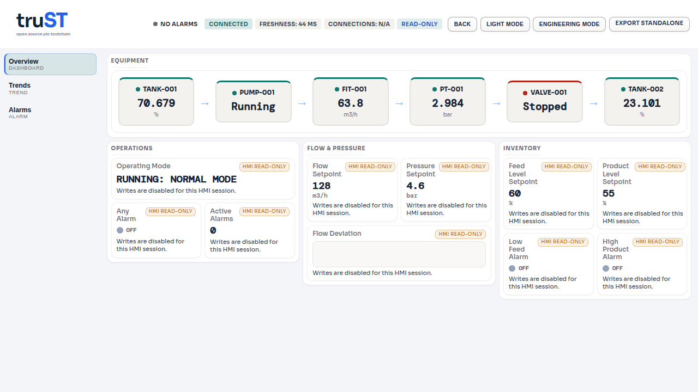

# Runtime host-failure resilience batch validation

Date: 2026-07-15

Final source checkpoint: `2298b6dc4ff55ec6a1ecbb2a7c8b10b15785394b`

Broad-gate checkpoint: `182ecf7659b342e7988a99cb20ee7b676741d080`

## Outcome

This batch found and fixed one runtime product defect. The embedded web server
handled accepted connections serially, so a client that declared a request body
and then stopped sending it blocked unrelated HMI traffic. The focused red
checkpoint demonstrated both the head-of-line block and the absence of a
prompt overload response.

The batch also deepened the retain-store failure matrix. Deterministic tests now
exercise every production filesystem call boundary and a real filesystem path
failure. This work found a fail-open inspection edge: `Path::exists()` discarded
metadata errors before load. The production load path now performs one open and
treats only `NotFound` as an absent snapshot; every other open or read failure is
reported.

These are truST host-resilience contracts, not IEC language deviations. No IEC
decision or deviation record changed.

## Tests first and product fix

Commit `6155115889a3deaabdbfede51bb631351ff62f34` added the written web
isolation contract and two socket-level regression tests before the product
fix:

- `incomplete_body_does_not_block_unrelated_hmi_request` timed out while
  requesting `/hmi` because the incomplete body held the only accept/route
  path.
- `saturated_body_lane_rejects_promptly_without_blocking_hmi_and_recovers`
  timed out waiting for the fifth body request instead of receiving a bounded
  rejection.

Commit `2d69afa63919f81b9f7e720b82382c1bd38c7702` introduced the minimal
runtime changes:

- four read workers behind a queue of 32 requests;
- four body workers with exactly four admitted body-bearing or mutating
  requests;
- conservative body-lane classification for positive `Content-Length`, any
  `Transfer-Encoding`, and every method other than GET, HEAD, and OPTIONS;
- prompt HTTP 503 overload responses with `Retry-After: 1` and denial code
  `server_busy`;
- panic isolation inside each request worker;
- a private retain filesystem seam used only by tests;
- atomic retain replacement with visible create, write, flush, file-sync,
  rename, directory-sync, open, and read failures;
- retry of a failed retain save without requiring a new dirty mark.

The same commit synchronized the release metadata at `0.24.46`, updated the
changelog, and updated and rendered the two affected architecture diagrams.

Commit `182ecf7659b342e7988a99cb20ee7b676741d080` rebound the existing
runtime-anomaly associations to the passing web tests and added explicit direct
associations for the new retain filesystem matrix. Commit
`388c4487fa9cd33b56bee786403ac4ce566ae181` removed five clippy advisories in
the fault fixture without changing its behavior. The canonical focused suite
then exposed five stale count/posture tripwires. Commit
`2298b6dc4ff55ec6a1ecbb2a7c8b10b15785394b` refreshed those reviewed
baselines; the three owning modules pass 43/43, and the synthetic mapping tests
continue to prove that ignored and conditional associations are never runnable.

## Focused validation

On clean `trust-builder` worktrees using
`$HOME/.cache/codex-targets/trust-platform-gate`:

- The red web checkpoint failed both socket tests before the product fix.
- The fixed socket suite passed 2/2.
- Request classification and permit-reuse unit tests passed 2/2.
- The retain filesystem seam passed 5/5.
- `retain_integrity` passed 13/13, including the real path-shape failure test.
- `retain_store` passed 2/2.
- The retain failure trace case passed 1/1.
- Requested-stop and periodic pre-output retain failure tests each passed 1/1.
- Final-checkpoint `cargo clippy -p trust-runtime --tests` passed without
  advisories.

The final broad pass ran once at the broad-gate checkpoint after disk preflight
reported 66 GiB free under `/home/johannes` and 3.7 GiB under `/tmp`:

- `just fmt` passed.
- `just clippy` passed. It emitted the five test-fixture advisories removed by
  the final source checkpoint.
- `api_smoke` passed 3/3.
- `debug_control` passed 20/20.
- `complete_program` passed 1/1.
- `runtime_reliability` passed 4/4.
- `just test-all` passed; the run finished at 2026-07-15T01:08:39Z.
- The final canonical focused verification suite passed 767/767 on
  `trust-builder` in 395.225 seconds.
- All 15 installed report pairs passed their production at-rest validators.
- The final metadata graph validated at 480 records.

The five-line final cleanup changes only construction of injected test errors.
It was followed by clean targeted clippy and the full five-test retain seam,
not a second broad workspace run.

An attempt to create eight report worktrees concurrently stopped before any
generator ran because builder `/tmp` had 1.6 GiB free. The task-owned temporary
worktrees were removed, `/tmp` recovered to 4.3 GiB free, and regeneration was
completed in batches of at most three pristine worktrees. No artifact from the
failed checkout was used.

## Browser proof

The runtime was rebuilt and served on `trust-builder`. Playwright used the
installed Google Chrome channel to hold an incomplete body request open while
loading the real `/hmi` surface. The test required the exact `CONNECTED` badge,
fresh rendered values, and a successful HMI response; it passed 1/1 in 3.5
seconds. A first exploratory assertion was rejected because `/connected/i`
also matched `DISCONNECTED`; the committed test uses `^connected$`.

Screenshot SHA-256:
`e26ac38a4de4e1cc3f5f691419da20842595eed774c8aa75f4b70120e5f359e3`.

## Generated report refresh

All 15 installed report pairs were regenerated and passed their production
at-rest validators from the clean metadata checkpoint with timestamp
`2026-07-15T02:50:00+02:00`. The final lint-only commit changed four declared
input closures; only those four were regenerated with timestamp
`2026-07-15T03:11:16+02:00`. The reviewed baseline refresh then changed thirteen
declared input closures; only those thirteen were regenerated from the final
source checkpoint with timestamp `2026-07-15T03:35:09+02:00`. Every omitted
report remains valid because its declared input closure is byte-identical.

| Report | Source commit | JSON SHA-256 |
| --- | --- | --- |
| Test-class completeness | `2298b6dc4` | `15b3e131e083a691621de1357f48a9f1c88b53acc202432c791eea051e0d0fe8` |
| Coverage-matrix gaps | `2298b6dc4` | `51ad62625abf75ea6c85d97edf5f290bba1076080e9bcf92257ba14191d4fe27` |
| Malformed-input coverage | `2298b6dc4` | `d9cb60251fc63142a25e252701b7ee39926d780d16bc4787e1a59a8b59d91679` |
| Unmapped-test debt | `2298b6dc4` | `a672e807fac234f53828b6b495bd0c6c7315b2f0123e5ceff2318725b8a48693` |
| Test-refactor assessment | `2298b6dc4` | `d9de19c44928a44cdc9aa2c2709d03b9a172dfb9ba84bfd3faac802b44a4d18d` |
| Ignored-test inventory | `388c4487f` | `9b28e65ef4a1134a0c7415ecded7ce1931de9c0e29764f121a02f3836ebcb23b` |
| Invariant-seed audit | `2298b6dc4` | `d616fd478cd2270323c0036b14b9771f96d54f73bcdb5b4fc9c1c985cda9d626` |
| Specification completeness | `2298b6dc4` | `c3577034f9ccf1668247a06e54ac7aea023285c9a3df201fe0092df8dd990da7` |
| Phase 5 suite audit | `182ecf765` | `d4a40a1232662e2917e5e908e677987c40126b87c8fc816d46e6861348fe4ede` |
| Requirement/oracle audit | `2298b6dc4` | `9744622551d76abe5d619ba4045aec7d69c69e1b3e46107c68fcaa567afe7947` |
| Conformance alignment | `2298b6dc4` | `29189569324ef2700e4aaba26192805dd87aaef67e63b801ee12874bb629fddb` |
| Runtime-anomaly audit | `2298b6dc4` | `2c9fd033d62531879e060ddda4892d878c4516c8016c3d96221d1b80463d5f5a` |
| Fuzz-program audit | `2298b6dc4` | `a072e00a4fcc1537308ba168263b8c641f8a25472018652df8923681b0a44bc4` |
| Mutation program | `2298b6dc4` | `8a791da99144a6b51313d31715aae7769c3815d4d2074072416289fda0e8870c` |
| Specification-source audit | `2298b6dc4` | `2b1b20c05f71540bae892fdcb1b3f62fe87f16332277116e3e51c6eb954bfb53` |

The mutation report was rebound because its declared input closure changed.
No selector, runner, measured outcome, or survivor changed, so the measured
shards were not rerun.

## Honest remaining posture

- The scanner reports 3,926 facts, 137 catalog rows, 132 mapped facts, and
  3,794 unmapped facts.
- The ignored register reports 38 ignored and 2 conditional facts with zero
  diagnostics.
- The runtime-anomaly audit reports 19 classes, 46 explicit associations, 13
  mapped-runnable classes, and 6 remaining gap classes.
- `RT_SAFE_RETAIN_001` remains at G2 with
  `retain_failure_matrix_depth` recorded as proof debt. These runnable source
  tests do not rewrite its reviewed proof contract.
- The invariant register remains 53 total: 8 at G2 and 45 at S0.
- Specification gaps remain 34 total: 10 closed, 4 test-mapped, and 20 open.
- No specification gap, invariant proof level, suite, workflow, or CI
  enforcement state changed in this batch.
- CI remains report-only. Tagging and public release of version `0.24.46` are
  deferred until the change reaches `main`.
