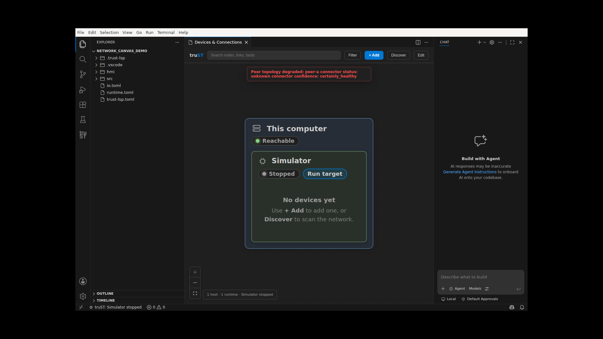

# Eighteenth-review findings closeout

Date: 2026-07-18

This record closes the actionable product and verification-tool findings from the
eighteenth independent PLC Verification Program review. It does not authorize or
perform the `VERIF-P16-007` enforcement flip.

## Product dispositions

| Finding | Disposition | Regression coverage | Change |
| --- | --- | --- | --- |
| H1 watchdog partial safe-state | Confirmed and fixed. A pre-commit fault restores the last committed image before overlaying configured safe-state values. | `TEST_REVIEW_WATCHDOG_PARTIAL_SAFE_STATE_001` | red `113b1622`; fix `2193486d` |
| H2 internally synthesized non-finite values | Confirmed and fixed. Explicit numeric, text, and bit-transfer conversions reject non-finite REAL/LREAL results. | `TEST_REVIEW_INTERNAL_NONFINITE_CONVERSION_001` | red `0ac91452`; fix `04ab4e67` |
| H3 cross-file field rename | Reported bypass did not reproduce. The merged-project declaration owner already rejects the case-insensitive sibling collision. A characterization test now locks that behavior. | `TEST_REVIEW_FIELD_RENAME_CROSS_FILE_001` | characterization `30602e97` |
| M1 malformed peer connector status | Confirmed and fixed. Valid peer topology is preserved and each malformed peer becomes a visible degraded-topology error. | `TEST_REVIEW_PEER_CONFIDENCE_REJECTION_001`, `TEST_REVIEW_PEER_TOPOLOGY_VISIBLE_FAILURE_001`, `TEST_REVIEW_PEER_TOPOLOGY_ERROR_RENDER_001` | red `dd73eb37`; fix `5b2ba80b`; spec `da450bb4` |
| M3 commit-helper scope edges | Confirmed and fixed. Canonical scope failures abort, and staged scope is rechecked after interactive delay before mutation. | `TEST_REVIEW_COMMIT_SCOPE_CONTAINMENT_001`, `TEST_REVIEW_COMMIT_SCOPE_RACE_001` | red `c3c88109`; fix `6623b2f2` |
| M5 didClose cache race | Confirmed and fixed. Closing a document advances request generation before cache eviction, preventing late cache publication. | `TEST_REVIEW_DIDCLOSE_CACHE_RACE_001` | red `ea52dc57`; fix `dc63fe68` |
| M6 read-lane saturation | Reviewed non-defect under the written bounded-overload contract. The four-worker, bounded-queue lane may reject excess work with stable `server_busy`; it must not hang or fail silently. No stronger availability claim is made. | existing web overload tests | no product change |
| LOW simulation-clock overflow | Confirmed and fixed by saturating at signed duration bounds. | `TEST_REVIEW_SIM_CLOCK_OVERFLOW_001` | red `fe524429`; fix `d1d65814` |
| LOW OPC UA server write exposure | Confirmed and fixed. Snapshot-backed variables advertise `CurrentRead` only until transactional write-back exists. | `TEST_REVIEW_OPCUA_SNAPSHOT_READ_ONLY_001` | red `3731ea5b`; fix `1068225d` |
| LOW invalid LSP edit and bare-CR range model | Confirmed and fixed. Invalid incremental edits return a full-resync error without mutation; range formatting uses the shared LF/CRLF/bare-CR model. | `TEST_REVIEW_LSP_INVALID_CHANGE_RANGE_001`, `TEST_REVIEW_LSP_BARE_CR_RANGE_FORMAT_001` | red `e732a9fa`; fixes `0b658251`, `c9f18aab` |

## Process and tooling dispositions

- M2 is recorded as historical process debt. The affected product fixes are now
  independently cataloged and tested; history was not rewritten.
- M4 is recorded as historical proof-production debt. No new mainline revert was
  used in this closeout.
- M7 was confirmed and fixed tests-first. Mutation-program report bytes no longer
  depend on the caller's output staging directory, and every report entry point
  now applies the same canonical output-path containment rule (`106fb166` ->
  `6539fd19`).
- The missing CHANGELOG entry for debug mutation lifecycle clearing was added in
  `6539fd19`.
- Catalog validation exposed a separate verification defect: the original
  cross-file rename command exited zero while selecting zero tests. The command
  now includes the module-qualified test name and executes exactly one test
  (`f95d004e`).
- Report regeneration failed closed on a stale OPC UA runtime-anomaly identity
  and then exposed nine unreviewed Rust facts. The denominator now partitions
  all 3,229 facts into 135 explicit associations and 3,094 reviewed
  non-mappings, with zero unreviewed facts (`7f8451df`).

## Real VS Code evidence

The extension suite passed 461 tests on `trust-builder`, including all three peer
status regressions. A real Extension Development Host was then opened under Xvfb.
A controlled capture fixture supplied the same degraded-peer graph contract that
the production host path emits; the committed product source was restored before
this evidence was recorded.

The DOM assertion required all of these rendered strings:

- `Peer topology degraded`
- `unknown connector confidence`
- `Simulator`
- `Stopped`

The assertion passed and the screenshot confirms that the red peer failure is
visible without replacing the usable local topology:

The paired machine-readable capture is
[`peer-topology-visible-failure.json`](assets/peer-topology-visible-failure.json).

## Proof posture

The thirteen newly cataloged regressions all passed on `trust-builder`. The
non-finite case-backed lock was regenerated against the expanded test binding.
The final invariant posture is intentionally limited to `G1`: the new ordinary
Rust and VS Code regressions do not emit the case artifacts required by
`broad-remote-gate.py v1`, so no new G2 claim is made. Existing broad records
remain historical evidence for their original contract and are not treated as
proof of the expanded test sets.

## Validation record

- Targeted Rust regressions: 10 commands passed. The corrected cross-file rename
  command selected and passed exactly one test.
- VS Code: `npm ci`, `npm run lint`, `npm run compile`, and `npm test` passed on
  `trust-builder`; `npm test` reported 461 passing tests.
- Real VS Code capture: one rendered interaction passed with DOM assertion and
  screenshot proof.
- Initial capture attempts that failed due to generated-harness escaping and
  nested-webview message isolation were infrastructure-only and produced no
  product-test failure.
- All fifteen generated report pairs reproduced from clean source revision
  `7f8451df3c6b6ff39df0531c49d778f20ab8d8bb`; all fifteen at-rest validators
  passed against the canonical copies. Digests and substantive counts are in
  `eighteenth-review-report-rebind.md`.
- Final builder validation passed: `just fmt`, `just clippy`, all four mandatory
  runtime verticals, `just test-all`, 856/856 focused verification tests, the
  781-record metadata gate, and 33/33 tooling self-tests. The isolated builder
  checkout and local checkout were clean. Exact durations and the reviewed
  census-tripwire refresh are recorded in
  `eighteenth-review-final-validation.md`.
