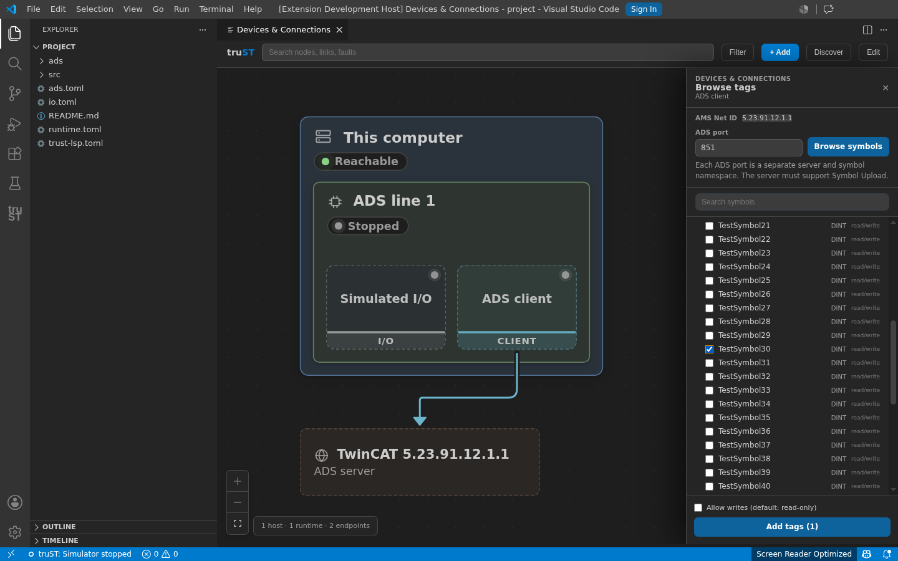
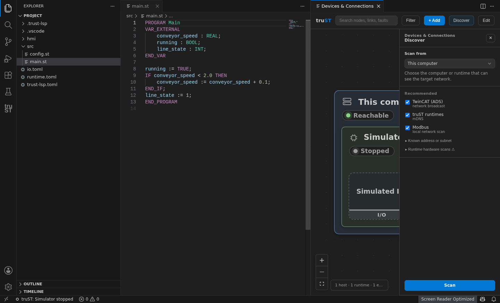
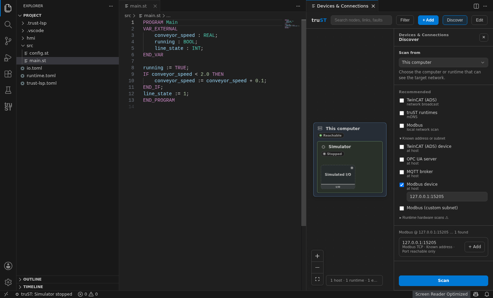
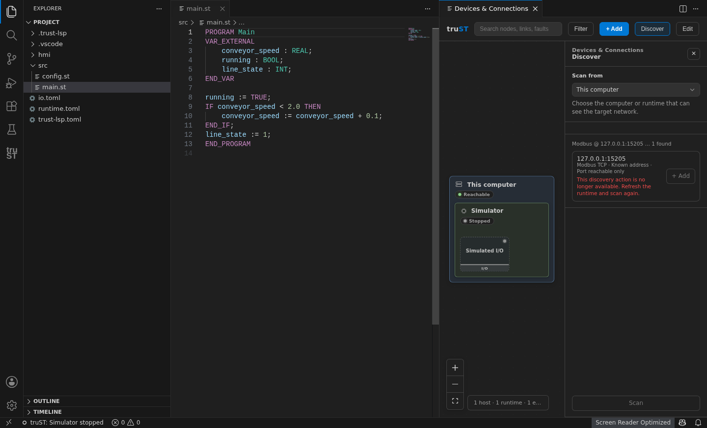
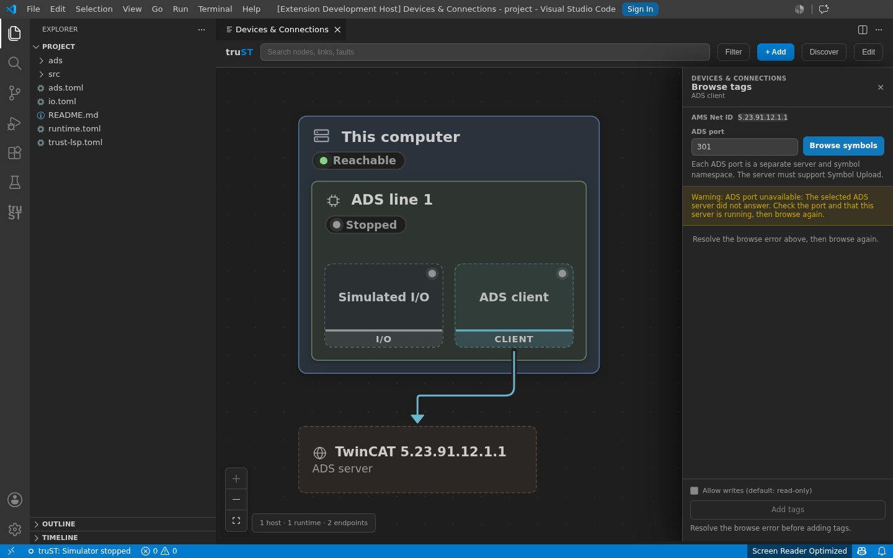
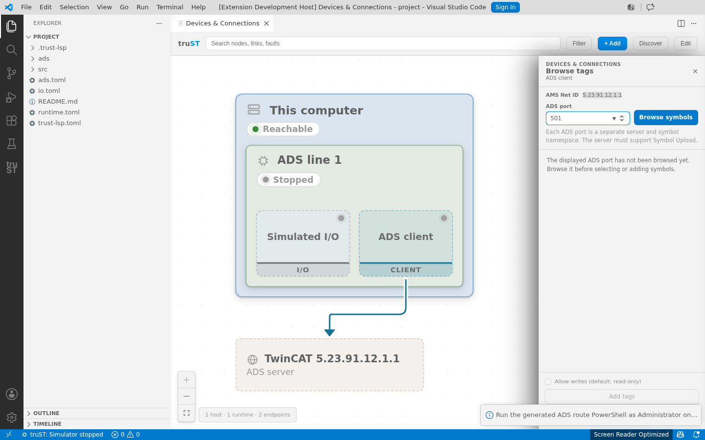
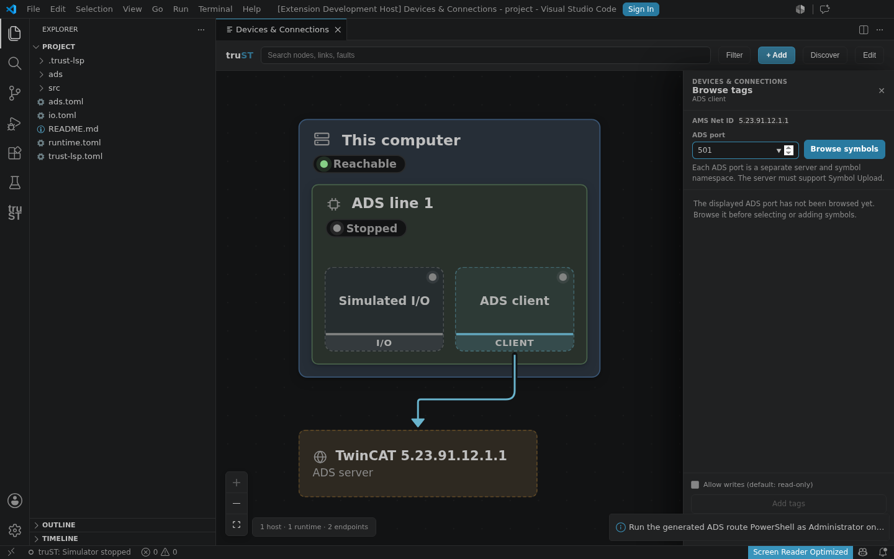

# GitHub issues 94-97 VS Code evidence (updated 2026-07-10)

This evidence was captured from the real truST Extension Development Host after
rebuilding `media/networkCanvasWebview.js` from the final branch sources.

- Bundle SHA-256:
  `42781816b0f436ce0f97e6b8d49ef193a9907a51709ff97cf8dc75634ec1add8`
- Bundle build time: `2026-07-10 00:11:23 CEST`
- Capture host: cached VS Code `1.127.0`, selected explicitly by the evidence
  runners so a newer cached host cannot silently change the proof environment.
- VS Code UI acceptance status: proof captured; `ux_accepted` remains pending
  independent review.

## Issue 94: native symbol checkbox interaction

Dark+, Light+, and Dark High Contrast journeys passed with native X11 XTest
input. A 60 ms pointer press/release and keyboard Space both toggled the native
checkbox after three graph refreshes; the runner also proved stable DOM identity
and geometry through 100 samples.

The exact reported failing baseline was not reproduced: the released baseline
also passed the native-input probe in this environment. Treat this change as
native/idempotent checkbox hardening plus a durable regression journey, not a
confirmed causal diagnosis of the reporter's original failure.

## Issue 95: remount and stale discovery sessions

The real extension journey changed editor layout, disposed and reopened the
webview, and observed a new iframe target ID. The remounted pane contained no
actionable stale card and no contradictory no-capability/result state. A new
scan produced a fresh card; native Add input opened the expected prefilled
Modbus form.

The journey also retained the real completed scan progress/result while driving
the same `meta` message shape used by the extension host with an empty
discoverable-protocol schema. The result stayed visible but disabled with a
recovery reason, and **No discovery is available yet** did not appear. Restoring
the full real `trust-runtime comm schema --json` payload re-enabled the card and
the native Add continuation still passed. This is real-bundle rendering proof
with a synthetic host-meta capability drop; it does not claim a runtime emitted
that mid-session drop naturally.

Machine-readable proof: [discovery-remount.json](proof/discovery-remount.json).

## Issue 96: writable ADS import recovery

The extension contract test proves the stopped-runtime writable import remains
fail-closed, uses a full modal detail message, exposes **Start runtime**, and
wires that action to the configured runtime lifecycle rather than simulation.

Visual modal capture is not claimed. The extension-test host explicitly refused
to display dialogs. A second normal Extension Development Host probe activated
the extension without `--extensionTestsPath`, but the command palette did not
expose Devices & Connections, so that probe could not reach the modal path.
Machine-readable blocker evidence:
[issue96-normal-host-blocked.json](proof/issue96-normal-host-blocked.json).

## Issue 97: selectable ADS server port

Dark+, Light+, and Dark High Contrast journeys passed. Native input changed the
port from `851` to `301`; the actual webview-to-extension-host runtime-wrapper
request contained `ams_port: 301`, and the structured result was
`ads_port_unavailable`. Editing the draft to `501` without browsing hid the
previous error, route action, and symbol tree and disabled writes/Add until that
exact port was browsed.

Theme proof:

- [Dark+](proof/ads-dark.json)
- [Light+](proof/ads-light.json)
- [Dark High Contrast](proof/ads-high-contrast.json)

This is deterministic UI/extension/runtime-contract proof only. It does not
claim TwinCAT hardware validation for ADS ports `301` or `501`.
