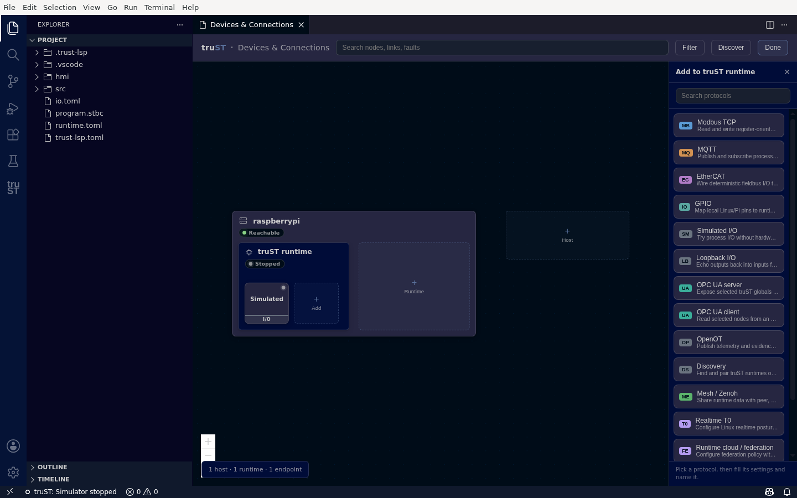

# Add A Device

Add and configure any device or service from [Devices & Connections](communication-panel.md), using a
typed form — you never hand-edit `io.toml`.

## 1. Open the add flow

In Devices & Connections, click **Edit**. Each runtime and host gains **+** slots. Click the **+ Add**
slot on the runtime you want to add a device to.

## 2. Pick a protocol

A drawer opens — **Add to truST runtime** — listing every protocol with a one-line description, searchable
at the top.

*Pick a protocol — each entry says what it's for, so you don't need to know the wire details up front.*

The choices, grouped by what they do:

- **Field devices and local I/O:** EtherCAT, GPIO, Simulated I/O, Loopback I/O.
- **External systems:** Modbus TCP, MQTT, OPC UA client/server, Beckhoff ADS client/server, OpenOT.
- **Runtime-to-runtime:** Discovery, Mesh / Zenoh, Realtime T0, Runtime cloud / federation.

## 3. Fill the typed form

Pick a protocol and truST renders its form from the runtime's own schema — every field has a label,
a safe default, and inline help; required fields are marked. As you fill it in, a **DRAFT** node previews
on the canvas.

*A typed form per protocol — here Modbus TCP: device address, unit ID, register starts, timeout, and on-error behaviour, each with a default and help.*

Click **Save** to write the configuration. truST applies it to the project (`io.toml` or the relevant
config), and the draft becomes a real endpoint node. If the runtime is running, you can also apply it live.

## Discover and browse

Some protocols can find devices for you, instead of typing addresses:

- **Discover** (toolbar) scans for devices, servers, and other runtimes — *discovered means seen*, not
  connected. Modbus and MQTT use an address/topic setup rather than a tag tree.
- **Browse** (on a saved OPC UA client, ADS client, or EtherCAT node) reads the target's live address
  space or PDO channels so you can select symbols to add, instead of naming them by hand.

Each protocol's own guide walks through its specific discover/browse/test flow — see
[External Systems](external-systems/index.md) and [Devices And Fieldbus](devices-and-fieldbus/index.md).

## Next

- [Devices & Connections](communication-panel.md)
- [Modbus TCP](external-systems/modbus-tcp.md)
- [MQTT](external-systems/mqtt.md)
- [OPC UA](external-systems/opc-ua.md)
- [Beckhoff ADS](external-systems/ads.md)
