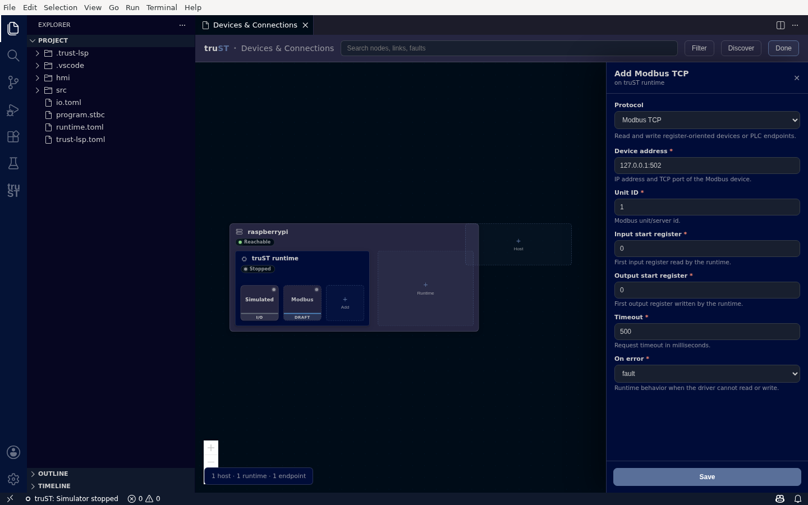

# Add A Device

Add and configure any device or service from [Devices & Connections](communication-panel.md), using a
typed form — you never hand-edit `io.toml`.

## 1. Open the add flow

In Devices & Connections, click the first-class **+ Add** toolbar action. You do not need to enter a
hidden Edit mode first.

## 2. Pick a protocol

A drawer opens — **Add device or connection** — with searchable choices grouped by what you want to do.

The top-level choices are:

- **Discover devices and runtimes**
- **Devices and I/O**
- **Read tags from another PLC or server**
- **Share truST values**
- **Send and receive messages**
- **Advanced integrations**

Each entry explains its purpose before exposing wire details. Across those groups you can choose
EtherCAT, GPIO, Simulated I/O, Loopback I/O, Modbus TCP, MQTT, OPC UA client/server, Beckhoff ADS
client/server, OpenOT, Discovery, Mesh / Zenoh, Realtime T0, and Runtime cloud / federation.

## 3. Fill the typed form

Pick a protocol and truST renders its form from the runtime's own schema — every field has a label,
a safe default, and inline help; required fields are marked. As you fill it in, a **DRAFT** node previews
on the canvas.

*A typed form per protocol — here Modbus TCP: device address, unit ID, register starts, timeout, and on-error behaviour, each with a default and help.*

Click **Save** to write the configuration. truST applies it to the project (`io.toml` or the relevant
config), and the draft becomes a real endpoint node. If the runtime is running, you can also apply it live.

## Discover and browse

Some protocols can find devices for you, instead of typing addresses:

- **Discover** (toolbar) scans for devices, servers, and other runtimes — *discovered means seen*, not
  connected. Modbus and MQTT use an address/topic setup rather than a tag tree.
- **Browse** (on a saved OPC UA client, ADS client, or EtherCAT node) reads the target's live address
  space or PDO channels so you can select symbols to add, instead of naming them by hand.

Each protocol's own guide walks through its specific discover/browse/test flow — see
[External Systems](external-systems/index.md) and [Devices And Fieldbus](devices-and-fieldbus/index.md).

## Next

- [Devices & Connections](communication-panel.md)
- [Modbus TCP](external-systems/modbus-tcp.md)
- [MQTT](external-systems/mqtt.md)
- [OPC UA](external-systems/opc-ua.md)
- [Beckhoff ADS](external-systems/ads.md)
