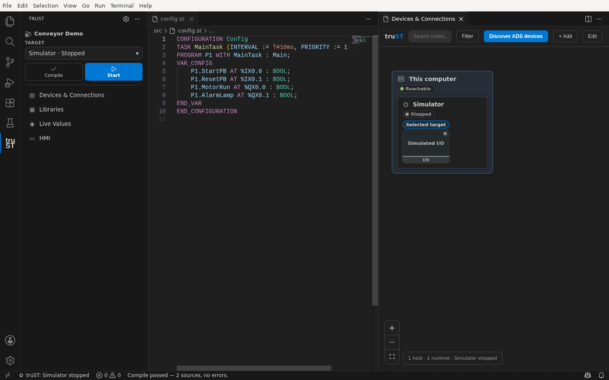

# Devices & Connections

**Devices & Connections** is the single front door for everything truST talks to — field devices, brokers,
PLCs, fieldbuses, and other runtimes. It shows your whole communication topology as a node graph, and lets
you add and configure a device without editing TOML by hand.

> Earlier versions of truST used a flat "Communication" panel of cards. That panel has been replaced by
> this graph. If a guide still mentions the *Communication panel*, it means Devices & Connections.

## Open it

In the truST view, click **Devices & Connections**. The graph opens as an editor tab titled
**Devices & Connections**.

## Read the graph

*Devices & Connections shows the local topology as one graph — here This
computer contains a stopped Simulator and its Simulated I/O endpoint.*

The graph nests **Host → Runtime → Endpoint**:

- **Host** (for example **This computer**) — the machine the runtime runs on; its badge is *reachability*
  (**Reachable**), not the runtime's run state.
- **Runtime** (for example **Simulator**) — your runtime, shown **Stopped** in grey until you start it. truST
  never shows a fabricated green: a node is green only when it is genuinely running/connected.
- **Endpoints** — each device or service on the runtime, with a role badge (here **Simulated · I/O**).
  As you add devices, Modbus, MQTT, OPC UA, and other endpoints appear here, and the external systems they
  link out to render as connected nodes.

The footer summarizes the topology and runtime state (**1 host · 1 runtime ·
Simulator stopped**).

## Toolbar

- **Search** — find a node, link, or fault.
- **Filter** — show or hide protocols. Filtering never hides a faulted device.
- **Discover ADS devices** — search this computer and the local network for ADS
  devices, then show the logical ADS services that actually respond. Known
  addresses, AMS Net IDs, and custom service ports stay under **Advanced** for
  recovery.
- **Edit** — enter edit mode, where each runtime and host shows a **+** slot to add a device, runtime, or
  host.

## Add a device

Click **Edit**, then the **+ Add** slot on a runtime, and pick a protocol. truST renders a typed form from
the runtime's own schema (labels, defaults, validation), so you fill in fields instead of writing config.
See the per-protocol guides for each one:

| Need | Protocol |
| --- | --- |
| Connect to an ADS device, or expose truST as an ADS device | ADS |
| Expose runtime variables to SCADA, HMI, or a historian | OPC UA |
| Read/write register-oriented equipment | Modbus TCP |
| Publish or subscribe through a broker | MQTT |
| Connect truST runtimes together | Discovery, Mesh / Zenoh, Realtime T0, Runtime cloud |
| Wire local hardware, or test without hardware | EtherCAT, GPIO, Simulated I/O, Loopback I/O |
| Publish telemetry/evidence records | OpenOT |

If a host has no runtime yet, its one action is **Set up runtime…**.

Secret fields (passwords, tokens) are never sent over an untrusted remote plain-TCP control channel — use a
same-host runtime endpoint, or apply the configuration on the runtime host.

## Next

- [Protocol Matrix](protocol-matrix.md)
- [External Systems](external-systems/index.md)
- [Runtime To Runtime](runtime-to-runtime/index.md)
- [Devices And Fieldbus](devices-and-fieldbus/index.md)
