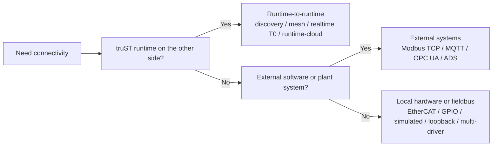

# Protocol Matrix

This is the first page to open when you want to know what communication
protocols and transport surfaces truST supports.

*Figure: Start with the endpoint class. Runtime federation, external software integration, and direct hardware wiring are different problem families and branch to different docs sections.*

## By problem type

| Question | Start here | Typical surfaces |
| --- | --- | --- |
| How do I connect two truST runtimes? | [Runtime-to-runtime](runtime-to-runtime/index.md) | discovery, mesh/Zenoh, realtime T0, runtime-cloud federation |
| How do I connect truST to another system? | [External systems](external-systems/index.md) | Modbus TCP, MQTT, OPC UA, Beckhoff ADS |
| How do I connect to local hardware or fieldbus? | [Devices and fieldbus](devices-and-fieldbus/index.md) | EtherCAT, GPIO, simulated, loopback, multi-driver |

## Runtime-to-runtime

| Surface | Best for | Go to |
| --- | --- | --- |
| discovery | finding peers and bootstrapping trust on a LAN | [Discovery And Pairing](runtime-to-runtime/discovery-and-pairing.md) |
| mesh / Zenoh | explicit runtime-to-runtime data sharing | [Mesh And Zenoh](runtime-to-runtime/mesh-zenoh.md) |
| realtime / T0 | same-host deterministic transport | [Realtime T0](runtime-to-runtime/realtime-t0.md) |
| runtime-cloud / web | federation, fleet, dispatch, browser control plane | [Runtime Cloud Federation](runtime-to-runtime/runtime-cloud-federation.md) |

## External systems

| Protocol | Best for | Go to |
| --- | --- | --- |
| Modbus TCP | coil/register-oriented PLC/device integration with explicit function-code profiles | [Modbus TCP](external-systems/modbus-tcp.md) |
| MQTT | brokered raw bytes, typed scalar topics, or bounded Sparkplug B outbound node metrics | [MQTT](external-systems/mqtt.md) |
| OPC UA | runtime variable exposure to OPC UA clients | [OPC UA](external-systems/opc-ua.md) |
| Beckhoff ADS | TwinCAT symbol import into truST globals, or exposing truST globals to ADS clients | [Beckhoff ADS](external-systems/ads.md) |

Runtime-to-runtime discovery and ADS target discovery are separate surfaces.
truST runtime discovery uses mDNS/pairing for truST peers; Beckhoff ADS
discovery uses ADS UDP identify/discovery toward TwinCAT targets.
ADS server mode is also separate from discovery: external ADS clients add a
route to the truST runtime host, then browse the symbols truST exposes.

Discovery candidates include a confidence label. `confirmed` means a
protocol-level handshake succeeded, `likely` means the endpoint answered with a
protocol-shaped rejection, and `port_reachable` means only TCP reachability was
observed. A `port_reachable` Modbus or MQTT candidate is not treated as a
confirmed device or broker. For Modbus targets that do not support FC43/14
device identification, pass an explicit safe read address and unit id when
probing so truST can confirm the protocol without writing to the device.

An MQTT authentication or authorization rejection is reported as `likely`
with `auth_required = true`: it is protocol-shaped evidence, but it did not
establish an accepted broker session. Discovery uses a clean session and sends
DISCONNECT immediately after CONNACK.

## Evidence status

The labels below describe the strongest committed evidence, not a blanket
production-readiness claim. Deployment readiness also depends on the selected
device, security configuration, topology, and site acceptance testing.

| Surface | Committed software evidence | Physical-hardware evidence | Honest boundary |
| --- | --- | --- | --- |
| Beckhoff ADS | protocol/server loopback, status projection, route and symbol-path tests | optional device-in-loop gate only | loopback success does not prove a TwinCAT route or target is production-ready |
| Modbus TCP | protocol-response probes, safe-read fallback, TCP-only negative tests, and mock integration | optional device-in-loop gate only | TCP reachability is never Modbus confirmation |
| MQTT | CONNECT/CONNACK probes, clean-session DISCONNECT, typed mapping, and mock broker tests | optional broker interop gate only | loopback/mock success does not prove a production broker, credentials, or TLS policy |
| OPC UA | server/client loopback and persistent-client lifecycle traces | no general physical-device claim | endpoint configuration or a mock transport is not a live plant session |
| EtherCAT | deterministic mock process image and unavailable-adapter lifecycle tests | optional device-in-loop topology gate only | mock operation is not physical bus proof; missing hardware must remain visibly faulted |

The optional device-in-loop gates skip visibly when their reviewed environment
variables are absent. A skipped gate supplies no hardware proof.

## Device and fieldbus drivers

| Driver | Best for | Go to |
| --- | --- | --- |
| EtherCAT | deterministic fieldbus I/O | [EtherCAT](devices-and-fieldbus/ethercat.md) |
| GPIO | direct edge/local pin mapping | [GPIO](devices-and-fieldbus/gpio.md) |
| simulated | fake process inputs without hardware | [Simulated And Loopback](devices-and-fieldbus/simulated-and-loopback.md) |
| loopback | fast local `%Q -> %I` sanity checks | [Simulated And Loopback](devices-and-fieldbus/simulated-and-loopback.md) |
| multi-driver | one runtime talking to more than one driver family | [Multi Driver](devices-and-fieldbus/multi-driver.md) |

## Next

- [Runtime To Runtime -> Transport Matrix](runtime-to-runtime/transport-matrix.md)
- [Devices And Fieldbus -> Driver Matrix](devices-and-fieldbus/driver-matrix.md)
