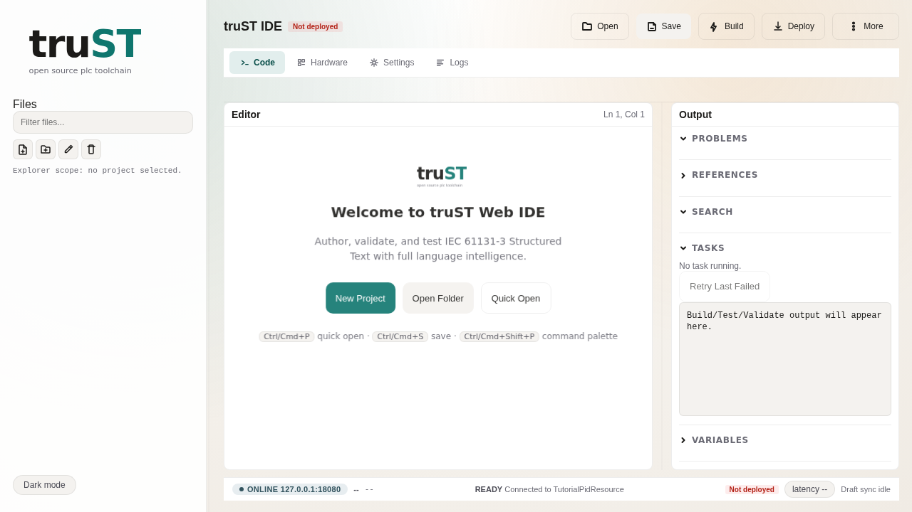

# truST

truST is a Structured Text engineering and runtime platform for building,
testing, running, and operating PLC-style systems.

## Choose Your Path

| Path | Best for | Start here | What success looks like |
| --- | --- | --- | --- |
| Program in VS Code | PLC engineers and controls developers | [Program In VS Code](start/program-in-vscode.md) | you can open a real project, run it, inspect `%I/%Q`, and fix one error |
| Program in Browser IDE | browser-first engineering and demos | [Program In Browser IDE](start/program-in-browser.md) | you can open `/ide`, build, validate, and jump to `/hmi` |
| Operate in Browser HMI | operators and technicians who were given a URL | [Operate In Browser HMI](start/operate-in-browser.md) | you can read overview/process/trends/alarms safely |
| Automate with CLI / CI / agents | shell, CI, harness, and JSON-RPC users | [Automate With CLI](start/automate-with-cli.md) | you can build, validate, test, and call `agent serve` |
| Maintain an existing project | inherited systems and handover work | [Maintain An Existing Project](start/maintain-an-existing-project.md) | you can open the project, identify the critical files, and make one safe change |

## Start Fast

- [Installation](start/installation.md)
- [Choose Your Workflow](start/choose-your-workflow.md)
- [Program In VS Code](start/program-in-vscode.md)
- [Program In Browser IDE](start/program-in-browser.md)
- [Operate In Browser HMI](start/operate-in-browser.md)
- [Automate With CLI / CI / agents](start/automate-with-cli.md)

## What Runs Where?

- [Architecture](concepts/architecture.md): how source files, build/validate, runtime, I/O, Browser IDE, HMI, CLI, and agent surfaces fit together.
- [Editors](start/editors.md): compare VS Code, Browser IDE, Neovim, Zed, and HMI browser surfaces.
- [Protocol Matrix](connect/protocol-matrix.md): choose how truST talks to devices, runtimes, and external systems.
- [Examples](examples/index.md): runnable projects mapped to the same categories as the docs.

## Visual Preview

### VS Code runtime workflow

### Browser IDE

### Browser HMI

## Need Help Fast?

- [Troubleshooting](troubleshooting.md)
- [Reference](reference/index.md)
- [About](about.md)
- [FAQ](faq.md)
- [Changelog](changelog.md)
