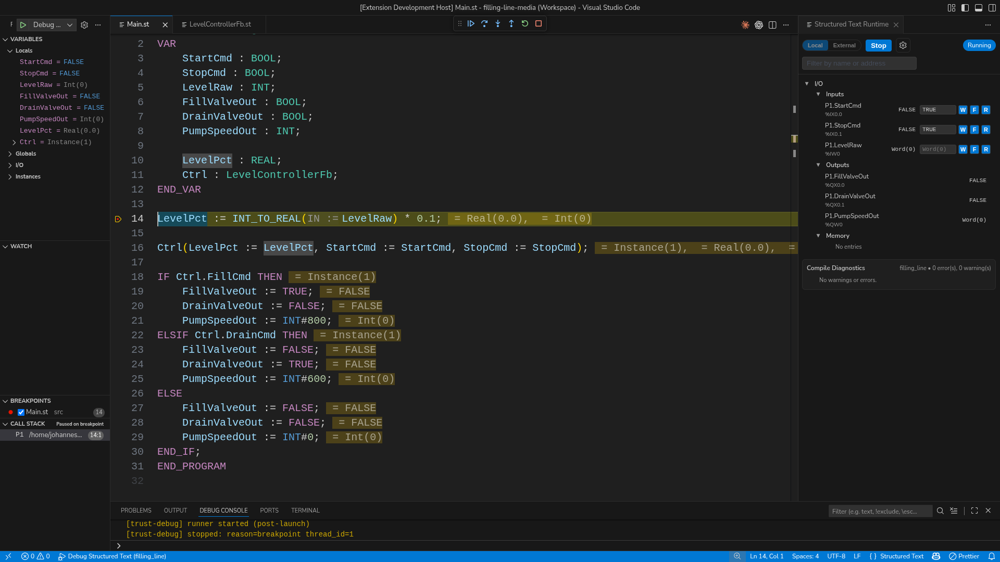
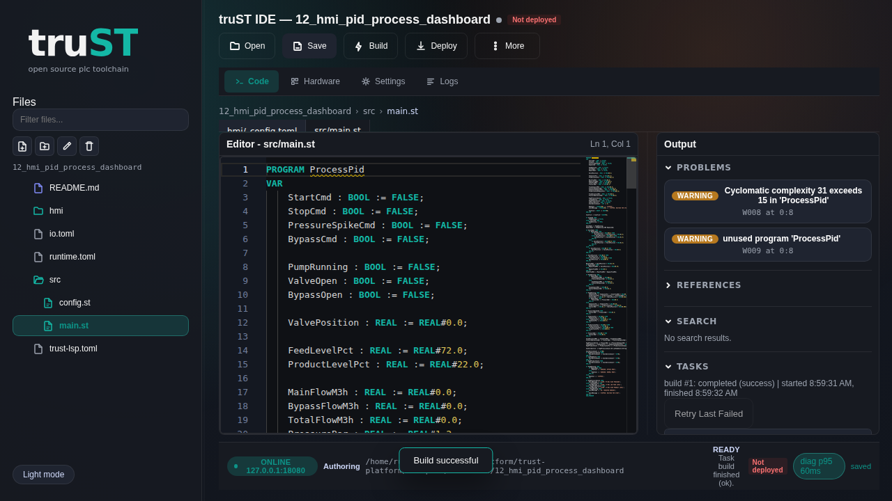

{ width="260" }

# truST

truST is a free IEC 61131-3 Structured Text IDE and runtime. Program PLCs in
desktop VS Code with an IEC-aware language server, run them on a laptop or a
Raspberry Pi, debug live, and expose browser HMI and automation surfaces from
the same project.

[Install truST](start/installation.md){ .md-button .md-button--primary }
[Browse Examples](examples/index.md){ .md-button }

*Figure:* VS Code with the Structured Text Runtime panel showing live I/O,
memory, and compile diagnostics.

## Capabilities

- author Structured Text in VS Code with IEC-aware diagnostics, navigation,
  formatting, refactors, and debugging
- run the same project locally or on a target device with `trust-runtime`
- inspect live I/O, memory, and compile diagnostics through the runtime panel
- expose the same project through `/ide` and `/hmi` when you want browser access
- automate build, validate, test, deploy, rollback, and agent workflows from a shell

## What truST Is

- one project for authoring, runtime, debugging, browser access, and automation
- desktop VS Code is the primary engineering surface, with the same project
  also available through the browser IDE and CLI/agent workflows
- one runtime binary for Linux, Windows, macOS, and Raspberry Pi
- open licensing, scriptable automation, and browser HMI pages shipped with the
  runtime
- `/ide` and `/hmi` run against the same bundle you build and deploy

## See It First

The desktop VS Code flow is the center of the product. These are the surfaces
that make it different.

### IEC-Aware Diagnostics

*Figure:* The language server reports IEC-aware diagnostics directly in the
Problems panel instead of only telling you that the file failed to parse.

### Debug Live

*Figure:* The debugger paused at a breakpoint with locals, call stack, inline
values, and the runtime panel visible beside the code.

### Rename Across Files

*Figure:* Rename a Structured Text symbol across files from the editor and
preview the affected definition before you apply the change.

### Also In The Browser

*Figure:* The same project can also be opened at `/ide` for browser-hosted
editing.

*Figure:* The same runtime can expose `/hmi` for operators and technicians.

### Architecture

*Figure:* Source files move through Build+Validate into artifacts
(`program.stbc`, `runtime.toml`, `io.toml`, `hmi/`), then into `trust-runtime`,
which exposes I/O drivers, the browser IDE at `/ide`, and HMI/control pages at
`/hmi`.

## Start Here

- [Installation](start/installation.md)
- [Program In VS Code](start/program-in-vscode.md)
- [Program In Browser IDE](start/program-in-browser.md)
- [Operate In Browser HMI](start/operate-in-browser.md)
- [Automate With CLI / CI / agents](start/automate-with-cli.md)

## Project And Support

- Maintainer: Johannes Pettersson
- License: MIT OR Apache-2.0
- Support: community issue tracker and maintainer contact

More detail lives on [About](about.md), [FAQ](faq.md), and
[Changelog](changelog.md).
