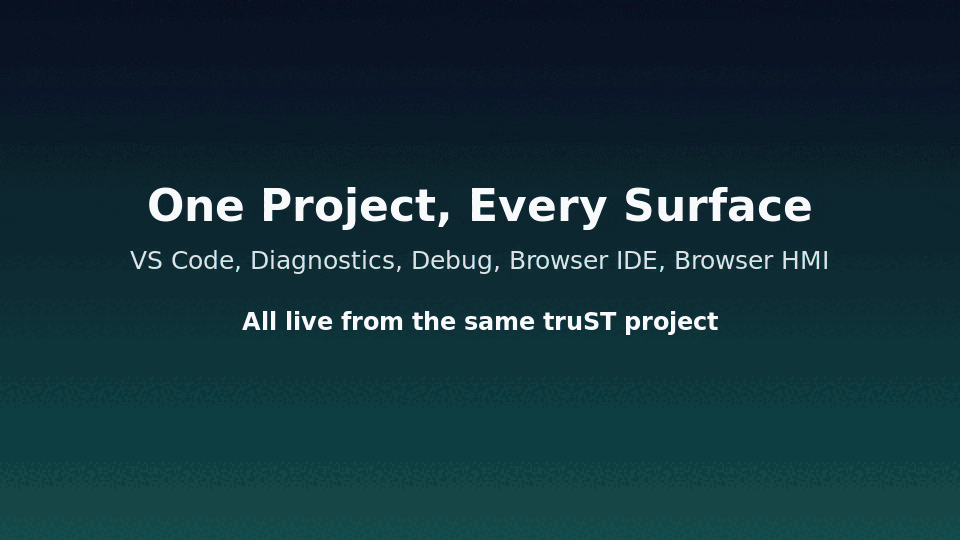
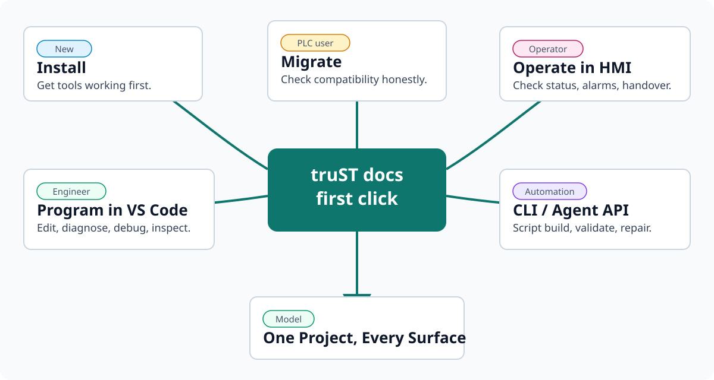

{ width="260" }

# truST

truST is an open IEC 61131-3 control workspace: one project edited in VS Code,
run by `trust-runtime`, observed through browser HMI, automated through CLI and
Agent APIs, connected through truST Mesh, and assisted by AI tools that can read
diagnostics and use typed truST surfaces.

[Choose Your Path](#choose-your-path){ .md-button .md-button--primary }
[Install truST](start/installation.md){ .md-button }
[One Project, Every Surface](concepts/one-project.md){ .md-button }

*Figure:* One project moving across the primary engineering, diagnostics,
debugging, browser IDE, and browser HMI surfaces.

## What truST Is

VS Code is the primary engineering surface for diagnostics, navigation, visual
editors, runtime inspection, debugging, and Editor AI tools. The runtime,
Browser IDE, Browser HMI, CLI/CI, Agent API, and truST Mesh all work from the
same project artifacts instead of creating separate models to reconcile later.

That is the product promise: edit, diagnose, operate, automate, connect, and
ask AI for help through typed truST surfaces while the project remains one
reviewable set of source, config, HMI, and bundle artifacts.

## Choose Your Path

*Figure:* The first docs click depends on the reader's job: evaluate, migrate,
operate, automate, or learn the system model.

| If you are... | Start here | You should leave with... |
| --- | --- | --- |
| new to truST | [Installation](start/installation.md) | a working editor extension and runtime binary |
| engineering a project locally | [Program In VS Code](start/program-in-vscode.md) | diagnostics, runtime panel, debug, and HMI confirmation |
| evaluating from PLCopen, CODESYS, Siemens, Mitsubishi, or OpenPLC | [Migrate Into truST](migrate/index.md) | an honest compatibility path and validation plan |
| operating a running system | [Operate In Browser HMI](start/operate-in-browser.md) | HMI checks, alarms, handover, and escalation routes |
| automating build, validation, tests, or repair loops | [Automate With CLI / CI / agents](start/automate-with-cli.md) | the CLI/Agent API surface to script safely |
| trying project-aware AI | [AI Assistance](develop/ai-assistance.md) | the boundary between Editor AI tools and Agent API automation |

## Proof Points

### Rename Across Files

*Figure:* Rename a Structured Text symbol across files from the editor and
preview the affected definition before you apply the change.

### Architecture

*Figure:* Source files move through Build+Validate into artifacts
(`program.stbc`, `runtime.toml`, `io.toml`, `hmi/`), then into `trust-runtime`,
which exposes I/O drivers, the browser IDE at `/ide`, and HMI/control pages at
`/hmi`.

## Project And Support

- Maintainer: Johannes Pettersson
- License: MIT OR Apache-2.0
- Support: community issue tracker and maintainer contact

More detail lives on [About](about.md), [FAQ](faq.md), and
[Changelog](changelog.md).
