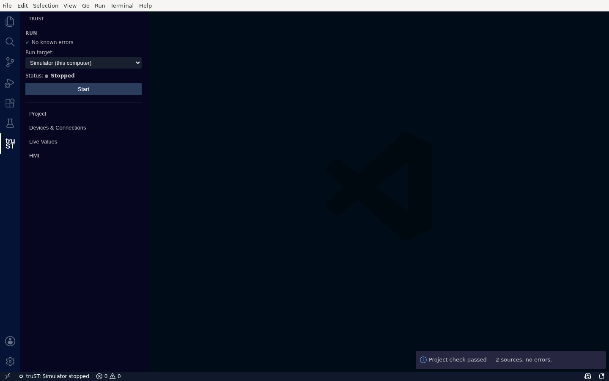
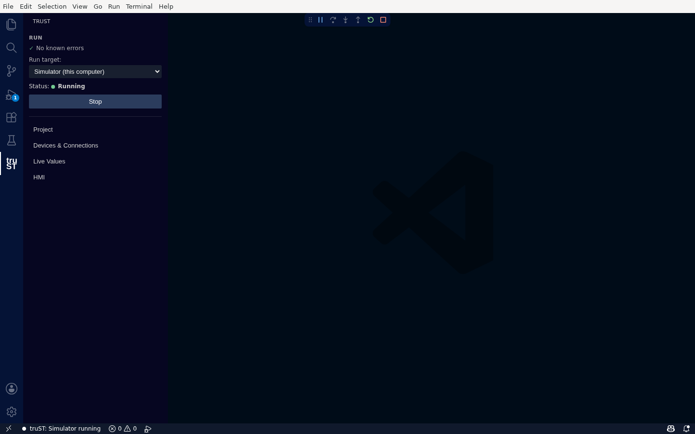

# Run & Check

Check that your program is valid, then run it on the simulator — both from the **Run** card in the truST
view, with honest status at every step.

## Check your program

Running **Check program** validates the whole project. On success you get a confirmation — *"Project check
passed — 2 sources, no errors."* — and the Run card's passive line reads **✓ No known errors**.

*Check validates the whole project before you run — the Run card shows "No known errors", the simulator selected, and a single Start button.*

The **✓ No known errors** line is diagnostics-derived: it means *nothing is currently flagged*, and it
updates live as you edit. It never claims a build is good when it isn't.

### When Check fails

If the project has errors, they appear in VS Code's **Problems** panel with their IEC references (for
example an undefined identifier on a specific line), and the Run card reflects that there are errors. Fix
them in the editor — the Problems entries are clickable and jump to the source. truST is honest here: a
broken config surfaces an error and a fallback, never a fake-green runtime.

## Choose where it runs

**Run target** selects where the program runs. For a new project this is **Simulator (this computer)** —
the built-in simulator, no hardware required. The dropdown lists only existing targets (the simulator, and
any runtimes you've added in [Devices & Connections](../connect/communication-panel.md)); you add or
connect targets there, not from this dropdown.

## Run on the simulator

Press **Start**. truST compiles your program and runs it on the simulator; the status changes to
**● Running** and the button becomes **Stop**. The status bar mirrors this (`truST: Simulator running`).

*Start runs your program on the local simulator — honest Running status, one Stop button, and the same state echoed in the status bar.*

- **Start** — compile, then run on the selected target.
- **Stop** — stop the simulator.
- **Apply changes** — appears when you've edited the source while the simulator is running, to hot-reload
  without a full restart (simulator only).

While it runs, open [Live Values](live-values.md) to watch and drive I/O, or set a breakpoint and use
[Debugging In VS Code](debugging-in-vscode.md) to step through the logic.

## Related

- [Debugging In VS Code](debugging-in-vscode.md)
- [Live Values: write, force, release](live-values.md)
- [Build, Validate, Test](build-validate-test.md)
- [Runtime UI And Control](runtime-ui-and-control.md)
