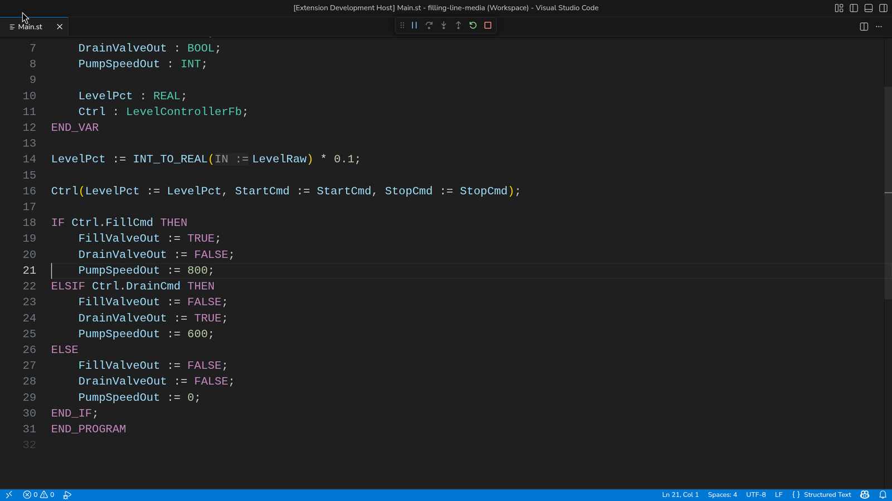
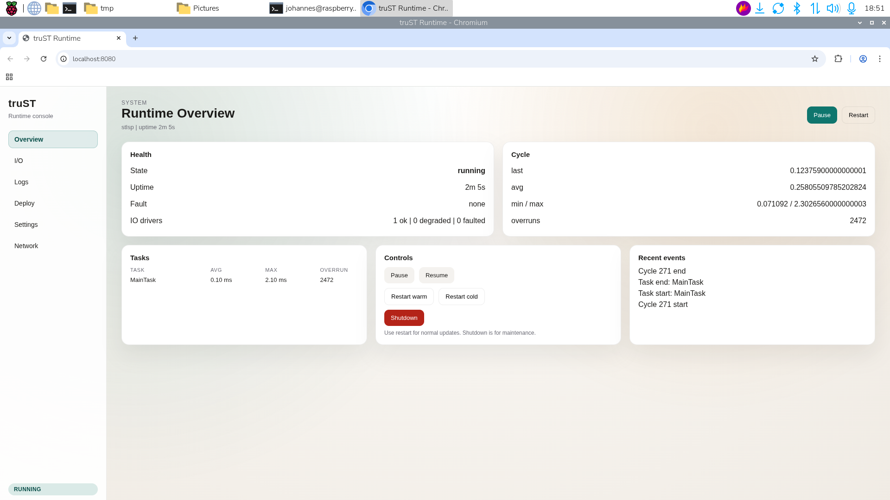

# Debugging And Runtime Panel

Use this page when you need breakpoints, stepping, live values, or the VS Code
runtime panel.

## What this surface gives you

- debugger
- runtime panel
- inline and runtime values
- live I/O inspection

## Fast path

1. Open a truST project in VS Code.
2. Run `Structured Text: Open Runtime Panel`.
3. Choose local or external mode.
4. Start the runtime.
5. Use `F5` when you need breakpoints and stepping.

## Runtime panel

Use the runtime panel for:

- live I/O read, write, and force actions
- quick local iteration without leaving the editor
- viewing runtime state while editing code

### Good panel workflows

| Task | Best surface |
| --- | --- |
| flip a simulated bit and watch the result | runtime panel |
| confirm `%I/%Q/%M` addresses are mapped as expected | runtime panel |
| inspect faults, restart, or control connection state | runtime panel |
| debug program flow with breakpoints | debugger |

### Common debug scenarios

#### Output never changes

1. Confirm the runtime is actually running.
2. Check whether the source variable is mapped in `Configuration.st`.
3. Inspect the runtime panel I/O tree for `%I` and `%Q` changes.
4. If the input changes but output does not, set a breakpoint in the ST logic.

#### Timer never fires

1. Confirm the task is scheduled in `CONFIGURATION`.
2. Confirm the runtime scan is running and not faulted.
3. Inspect the timer inputs or elapsed state in debugger or runtime panel.

#### Type mismatch or impossible write

1. Check diagnostics first.
2. Confirm the target address class matches the value you are writing.
3. Use [Build, Validate, Test](build-validate-test.md) before assuming the runtime is wrong.

## Debugger

Use the debugger when you need:

- breakpoints
- step in / step over / step out
- variable inspection
- inline values

The adapter is `trust-debug`, and VS Code drives it through the same runtime
control endpoint the rest of truST uses.

### Typical debugger flow

1. Build and validate the project first.
2. Start or attach to the runtime.
3. Set a breakpoint in the ST file you care about.
4. Press `F5`.
5. Inspect variables, step, and resume until the failure condition is understood.

### When not to use the debugger

- do not start with the debugger when simple diagnostics or a forced I/O check will answer the question faster
- do not treat debugger success as proof that hardware mappings are correct; verify through the runtime panel too

## Related

- [Runtime UI And Control](runtime-ui-and-control.md)
- [Agent Quickstart](../start/agent-quickstart.md)
- [trust-debug](../reference/cli/trust-debug.md)
