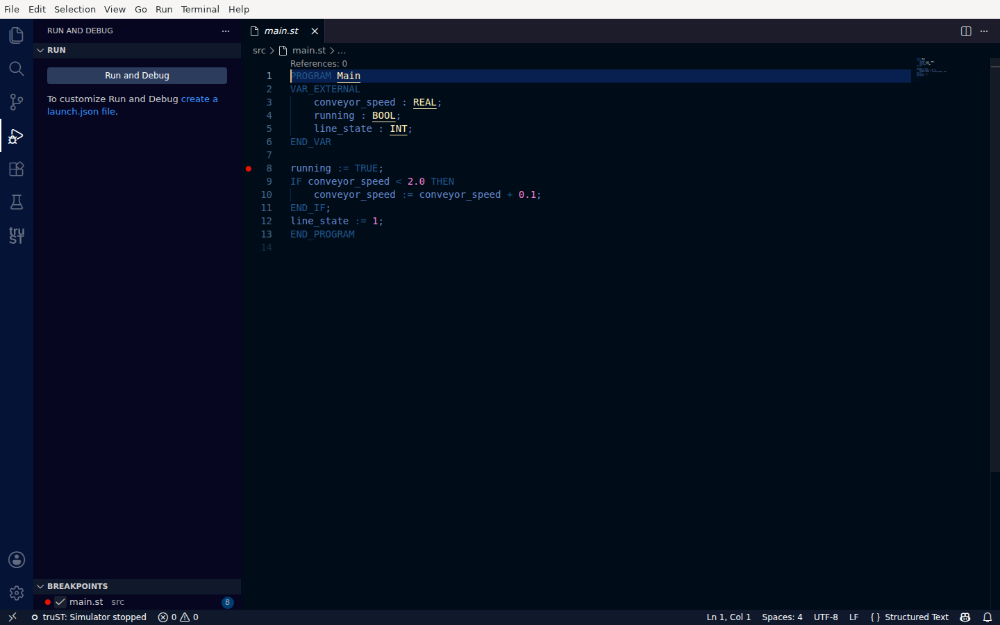
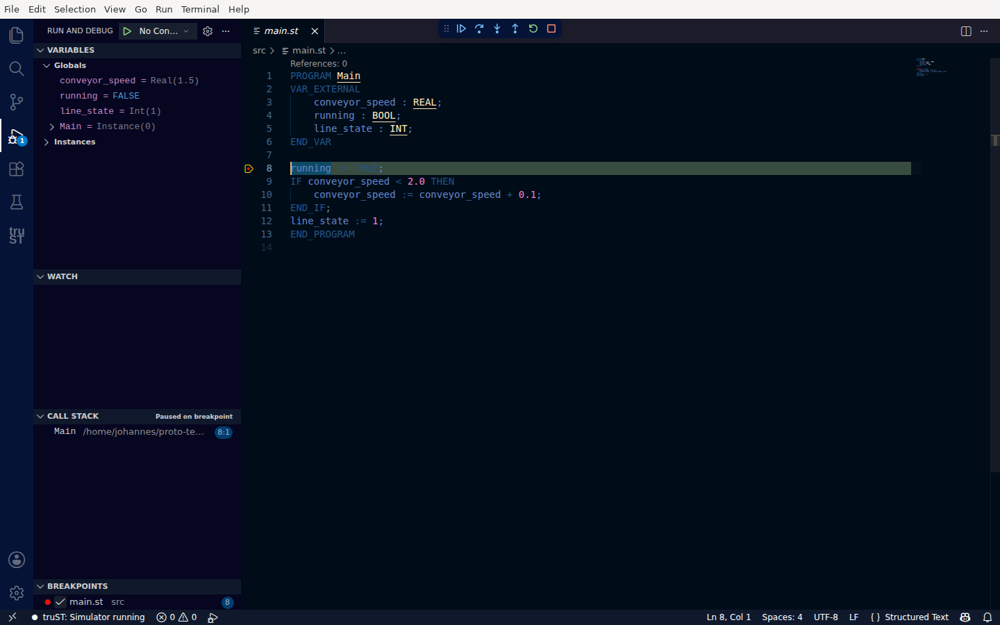

# Debugging In VS Code

Pause your program and inspect values line by line with breakpoints, using VS Code's standard debugger.

> Debugging is for stepping through *logic*. To just watch I/O update while the program runs, use
> [Live Values](live-values.md) instead.

## 1. Set a breakpoint

Open `src/Main.st` and click in the gutter to the left of a line (for example `running := TRUE;`). A red
dot marks the breakpoint, and it also appears in the **Run and Debug** view under **Breakpoints**.

*Click the gutter to set a breakpoint — the red dot marks where the program will pause.*

## 2. Start the simulator

Press **Start** on the Run card (or start from the Run and Debug view). The simulator runs your program;
when execution reaches your line, it pauses.

## 3. The program pauses at your breakpoint

When it pauses you can see, at a glance:

- the **current line** highlighted with a yellow arrow in the gutter (line 8 here),
- **Paused on breakpoint** in the **Call Stack** (`Main`),
- live values in **Variables** — `conveyor_speed = Real(1.5)`, `running = FALSE`, `line_state = Int(1)`,
- the **debug toolbar** at the top: Continue, Step Over, Step Into, Step Out, Restart, Stop.

*Paused at the breakpoint — the yellow arrow shows the current line, Variables shows live values, and the toolbar gives Continue and Step controls.*

**Success signal:** the yellow current-line arrow, "Paused on breakpoint" in the Call Stack, and real
values in Variables.

## 4. Step through the program

Use the debug toolbar:

- **Step Over** — run the current line and pause on the next.
- **Step Into / Step Out** — go into, or return from, a called block.
- **Continue** — resume until the next breakpoint (or until the next scan cycle hits the same line again).
- **Stop** — end the debug session.

While paused, you can change a value from [Live Values](live-values.md), then **Continue** and watch the
result.

## Next

- [Live Values: write, force, release](live-values.md)
- [Run & Check](debugging-and-runtime-panel.md)
