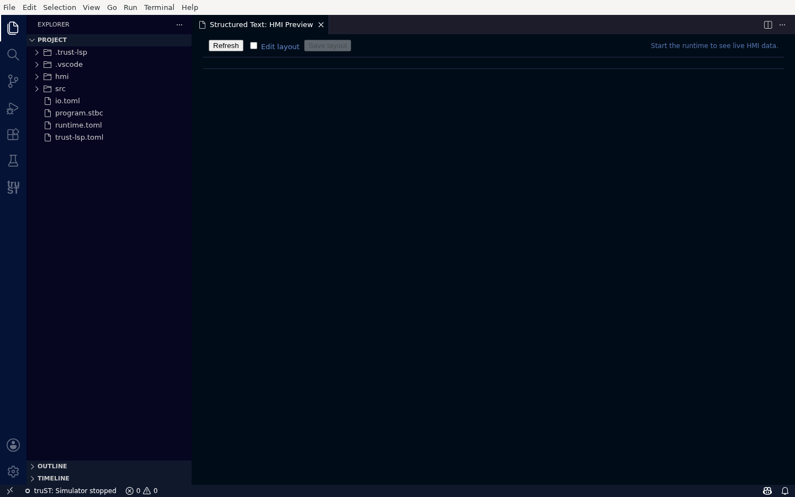
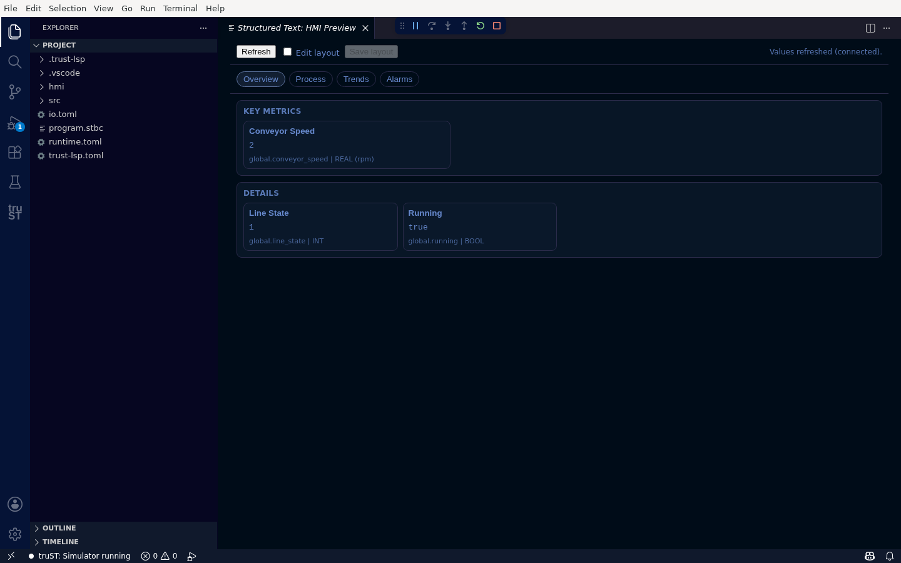

# HMI (Preview & Browser)

truST gives you two ways to see your operator HMI: a **Preview inside VS Code** while you develop, and the
**runtime-hosted HMI in a browser** for operators. Both render the same descriptor; authoring the
descriptor itself is covered in [HMI Authoring](../develop/hmi-authoring.md).

## VS Code HMI Preview

Open **HMI** from the truST view to preview the operator screen as an editor tab without leaving VS Code.

### Before the runtime is running

With nothing running, the preview is honest about it — it shows **"Start the runtime to see live HMI
data."** rather than a blank screen or stale values.

*Stopped, the preview tells you exactly what to do — start the runtime to see live data.*

### Once it's running

Start the simulator (or connect a runtime) and the preview shows the live operator screen, with
**"Values refreshed (connected)"** and pages across the top (**Overview**, **Process**, **Trends**,
**Alarms**). The Overview page shows your key metrics and details live.

*The live operator screen inside VS Code — key metrics and details update live, with an honest connection indicator.*

- **Overview / Process** — your dashboards and the generated P&ID process view.
- **Trends / Alarms** — these tabs render a designed, honest state explaining what they show (the preview
  doesn't draw time-series charts or the alarm list; for those, open the runtime's full web HMI). They
  never render a blank body.
- **Refresh** re-reads live values; **Edit layout** lets you rearrange the preview.

## Browser HMI

For operators, the runtime hosts the full HMI in a browser, outside VS Code.

*The runtime-hosted HMI dashboard — look here first for connection state, alarms, live values, and operator status.*

First-screen checks:

1. Confirm the connection badge is healthy.
2. Confirm freshness is current enough for the task.
3. Open the overview page before changing pages.
4. Check alarms before forcing or acknowledging anything.
5. Compare suspicious values against trends, Live Values, or field state.

This is the operator surface, not the authoring workflow. Do not edit `hmi/*.toml` from an operator
session — if the layout or bindings are wrong, hand it to engineering and use
[HMI Authoring](../develop/hmi-authoring.md).

## Related

- [Operate In Browser HMI](../start/operate-in-browser.md)
- [Live Values: write, force, release](live-values.md)
- [HMI Authoring](../develop/hmi-authoring.md)
- [Runtime UI And Control](runtime-ui-and-control.md)
- [HMI examples](../examples/hmi.md)
