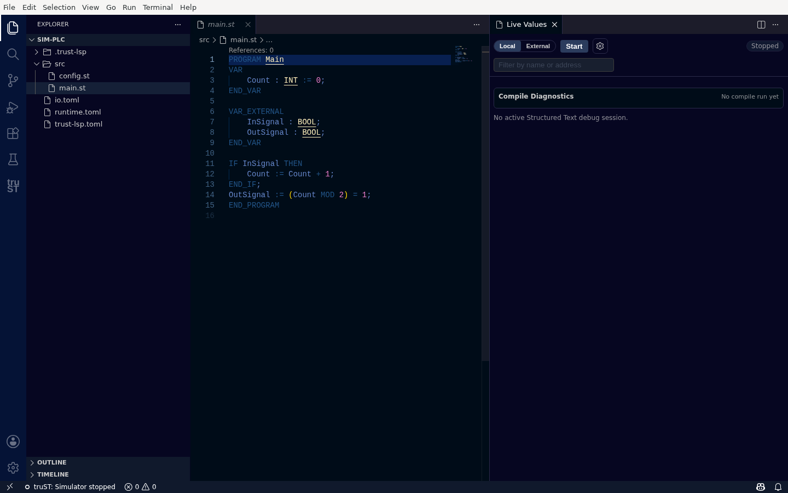
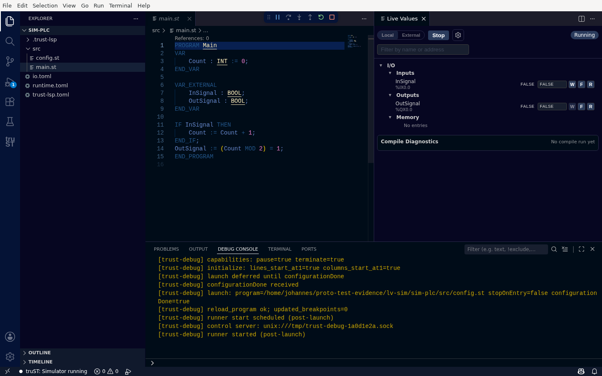
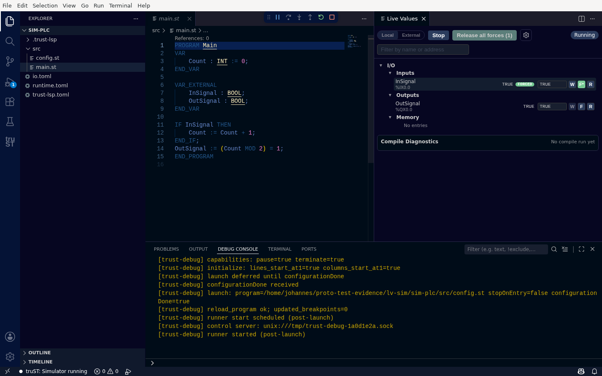
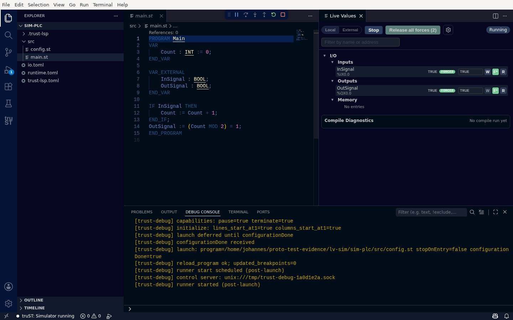
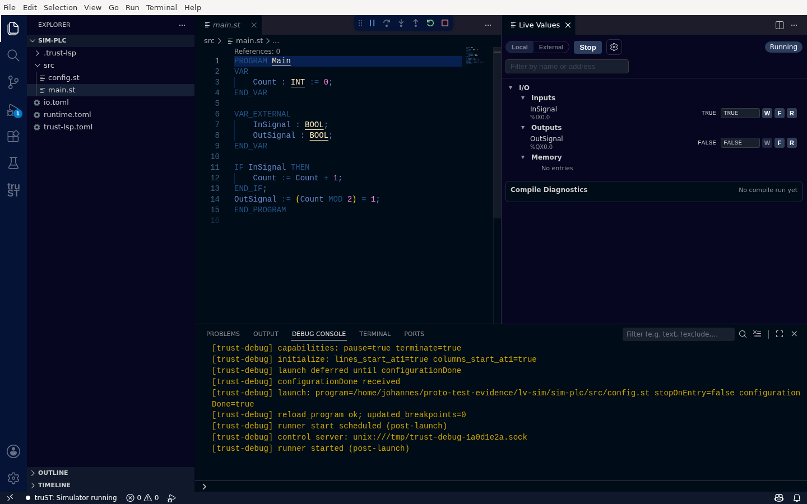

# Live Values: Write, Force, Release

**Live Values** shows your runtime's I/O and memory live, and lets you **write**, **force**, and
**release** values safely — without a debugger. Use it to watch I/O while the program runs and to drive
inputs during commissioning.

> Live Values is for *values*. To pause execution and step line by line, use
> [Debugging In VS Code](debugging-in-vscode.md).

## Open it

Click **Live Values** in the truST view (it also opens automatically when you Start the simulator). It
opens as a **Live Values** editor tab on the right.

## Before you start

With nothing running, Live Values shows a **Stopped** state and a **Start** button — there is no live data
to show yet.

*Before you start, Live Values honestly says there is nothing to show — press Start to run the simulator.*

## Live I/O while it runs

Once the simulator is running, the **I/O** tree fills in, grouped into **Inputs**, **Outputs**, and
**Memory**. Each row shows the symbol, its address (e.g. `%IX0.0`), its current value, and per-row
controls — **W** (write), **F** (force), **R** (release).

*Live I/O once the simulator is running — each signal shows its value and per-row Write / Force / Release controls.*

## Write a value

Click **W** on a row and enter a value. The write is applied and the row updates. A write sets the value
once; the program can change it again on the next scan.

## Force a value

Click **F** to **force** a value — it stays pinned at your value regardless of what the program does.
A forced value is unmistakable: it carries a green **FORCED** badge, and a **Release all forces** button
appears in the header with a count.

*Force an input — it is clearly badged **FORCED**, and the header shows how many forces are active.*

## Release forces

- **R** on a row releases that one force.
- **Release all forces (N)** in the header clears every override at once — the safety action to get back
  to live behaviour quickly.

*"Release all forces" clears every override at once — note the count tracks how many are active.*

After releasing, the **FORCED** badges and the **Release all forces** button disappear, and values return
to whatever the program is driving.

*After release, the overrides are gone and values are live again.*

## Honest by design

Write and force are deliberate, gated actions. If the target is disconnected, the runtime doesn't allow
the operation, or your role lacks permission, the control is disabled with a reason — Live Values never
fakes a successful write or a force that didn't take. Forced values always show their state, so an
override is never silently left in place.

## Next

- [Debugging In VS Code](debugging-in-vscode.md)
- [Devices & Connections](../connect/communication-panel.md)
