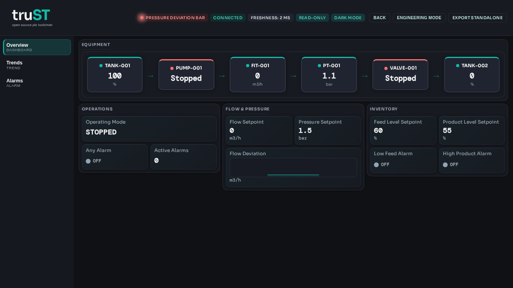
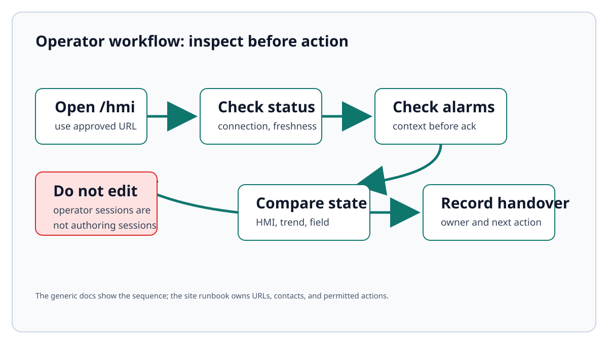

# Operator Guide

This page is the generic truST operator guide. Site-specific URLs, contacts,
alarm actions, and shift procedures belong in a local runbook.

The guide below teaches the baseline operator workflow: open the HMI, check
connection and freshness, watch alarms, avoid project edits from operator
sessions, and escalate when the process state does not match the screen. After
reading it, you should be able to turn a generic HMI URL into a local runbook
entry with site-specific contacts and procedures.

*Figure:* The Browser HMI overview shows the status strip, page navigation,
equipment chain, and operations cards an operator checks before following the
local runbook.

*Figure:* The generic operator path starts with status and alarm context. It
does not turn the operator session into a project-authoring surface.

## Guide

--8<-- "docs/guides/PLC_OPERATOR_GUIDE.md:3"

## Related

- [Operate In Browser HMI](../start/operate-in-browser.md)
- [Operator Daily Checks](operator-daily-checks.md)
- [Operator Alarm Handbook](operator-alarm-handbook.md)
- [Operator Shift Handover](operator-shift-handover.md)
- [Runtime UI And Control](runtime-ui-and-control.md)
- [HMI And Web UI](hmi-and-web-ui.md)
- [Troubleshooting](../troubleshooting.md)
