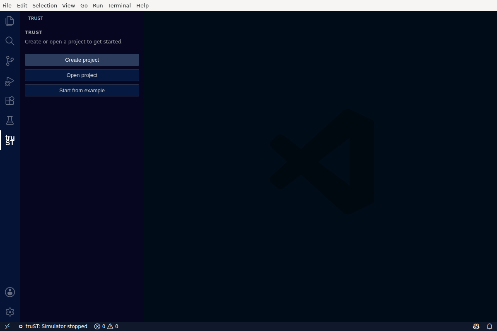
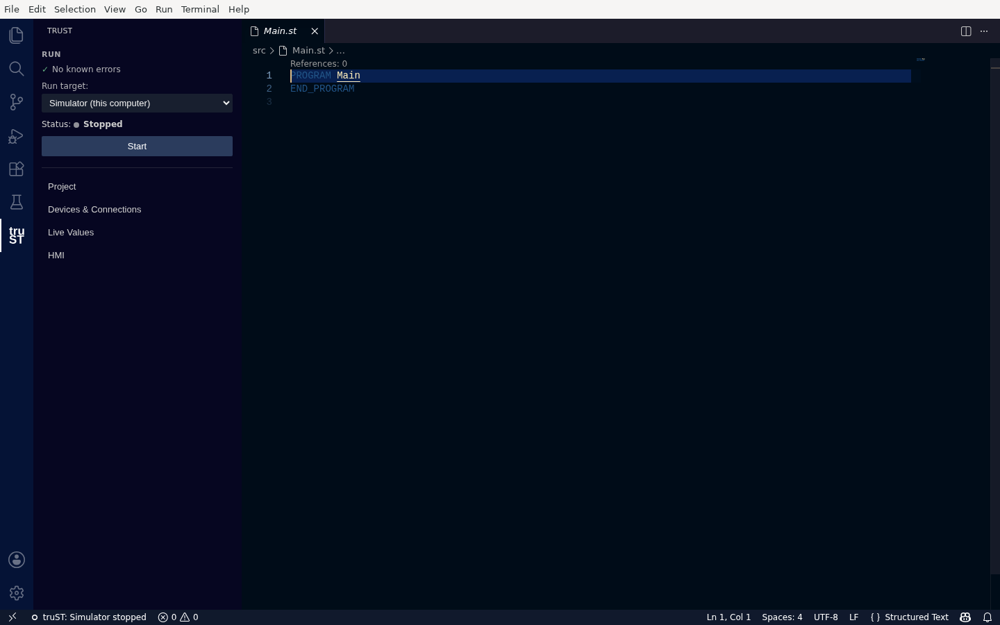

# Create A New Project

Create a new, **runnable** truST project from an empty folder — no config files to edit by hand.

## 1. Find truST and start a project

Click the **truST** icon in the Activity Bar (left edge). With no project open, the truST view shows one
line — *"Create or open a project to get started."* — and three buttons:

- **Create project** — scaffold a new, runnable project.
- **Open project** — open an existing truST folder.
- **Start from example** — copy a ready-made starter.



*With no project open, truST shows exactly one next step: create, open, or start from an example.*

## 2. Create the project

Click **Create project** and choose an empty folder (for example `my-first-plc`). truST scaffolds a
complete, runnable project and opens it. You never edit a config file to get started — the generated
`runtime.toml` and `io.toml` are valid out of the box with simulated I/O.

On Windows, truST generates an authenticated loopback control endpoint and a
fresh project token automatically, so the file is also valid for standalone
runtime tools. When you press **Start**, the debug adapter uses a separate
per-workspace authenticated endpoint; that random workspace token stays only in
memory and is never logged. Older local Windows projects that lack the required
file token are upgraded once before launch, so there is no manual
`runtime.toml` repair step.

What gets created:

```text
my-first-plc/
  trust-lsp.toml      # project settings (include_paths = ["src"])
  runtime.toml        # runtime configuration (control endpoint, simulator defaults)
  io.toml             # I/O wiring, set to simulated so it runs with no hardware
  src/
    Main.st           # your program, starting from an empty PROGRAM Main
    config.st         # a CONFIGURATION that instantiates Main (resource + task + PROGRAM Main WITH)
```

The `config.st` configuration is what makes the project actually run, and it opens warning-clean from the
first second.

## 3. Recognize the workspace

`src/Main.st` opens in the editor, and the truST view switches to the **Run** card:

- **✓ No known errors** — your project is valid.
- **Run target: Simulator (this computer)** — where the program will run.
- **Status: ● Stopped**, with a single **Start** button.
- Quick links: **Project**, **Devices & Connections**, **Live Values**, **HMI**.



*A new project opens to the Run card — "No known errors", the simulator selected as the Run target, and a single Start button.*

**Success signal:** the editor shows `src/Main.st` (language mode "Structured Text"), and the Run card
shows **✓ No known errors** with the simulator selected.

**If it doesn't work:** if the view still shows the create/open buttons, the folder wasn't recognized as a
truST project (no `trust-lsp.toml`) — reopen the folder you created.

## Next

- Write your logic: [Program In VS Code](program-in-vscode.md)
- Run it on the simulator: [Build, Validate, Test](../operate/build-validate-test.md)
- Prefer a ready-made starter? [Start from an example](../examples/index.md)
- [Project Layout](../develop/project-layout.md)
