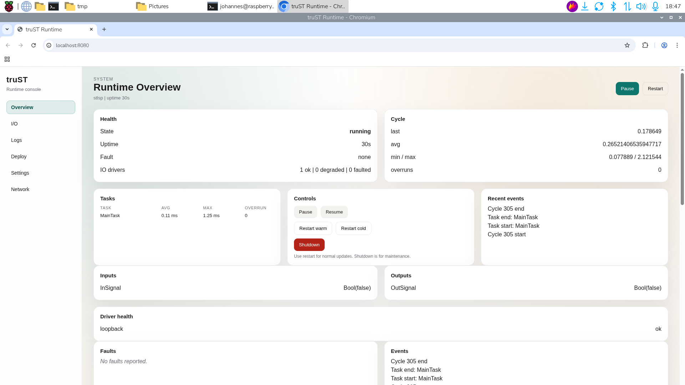

# First Run And Setup

## Local runtime first

The simplest first success is a local runtime:

```bash
trust-runtime play --project ./my-plc
```

Or from VS Code:

1. Open the runtime panel.
2. Choose `Local`.
3. Start the runtime.



## Guided setup

If you need guided runtime or I/O setup, use:

```bash
trust-runtime setup --project ./my-plc
```

For browser-guided setup on a specific port:

```bash
trust-runtime setup --mode browser --project ./my-plc --port 8080
```

## What success looks like

- the runtime starts cleanly
- diagnostics are clear
- you can inspect or write process values through the runtime panel or control plane
- the control endpoint and any enabled web UI bind without conflict

### Typical first-run signals

From the CLI path you should recognize this general shape:

- the project is detected
- runtime settings are loaded
- the runtime enters running state
- control and web endpoints are printed if enabled

From the editor path you should recognize:

- runtime status changes from stopped to running
- the I/O tree populates
- reads/writes/forces no longer show connection errors

## Quick commissioning loop

1. Run `trust-runtime build --project ./my-plc --sources src`.
2. Run `trust-runtime validate --project ./my-plc`.
3. Start the runtime with `trust-runtime play --project ./my-plc`.
4. Open the runtime panel or web UI.
5. Toggle one safe input or simulated value and verify the mapped output.

## Common first-run failures

| Symptom | Usually means | Go to |
| --- | --- | --- |
| bind/listen error | port/socket already in use | [Troubleshooting](../troubleshooting.md) |
| runtime starts but no I/O changes | wrong driver or address mapping | [I/O Binding](../connect/devices-and-fieldbus/io-binding.md) |
| validation passes but runtime faults on hardware access | host permissions or driver backend issue | [GPIO](../connect/devices-and-fieldbus/gpio.md) / [EtherCAT](../connect/devices-and-fieldbus/ethercat.md) |
| editor connects but debug/runtime panel stays empty | control endpoint mismatch or runtime not started | [Debugging And Runtime Panel](../operate/debugging-and-runtime-panel.md) |

## Related setup surfaces

- [Build, Validate, Test](../operate/build-validate-test.md)
- [Compile, Validate, Reload](../operate/compile-validate-reload.md)
- [Runtime UI And Control](../operate/runtime-ui-and-control.md)

## Next

- [Build, Validate, Test](../operate/build-validate-test.md)
- [Debugging And Runtime Panel](../operate/debugging-and-runtime-panel.md)
