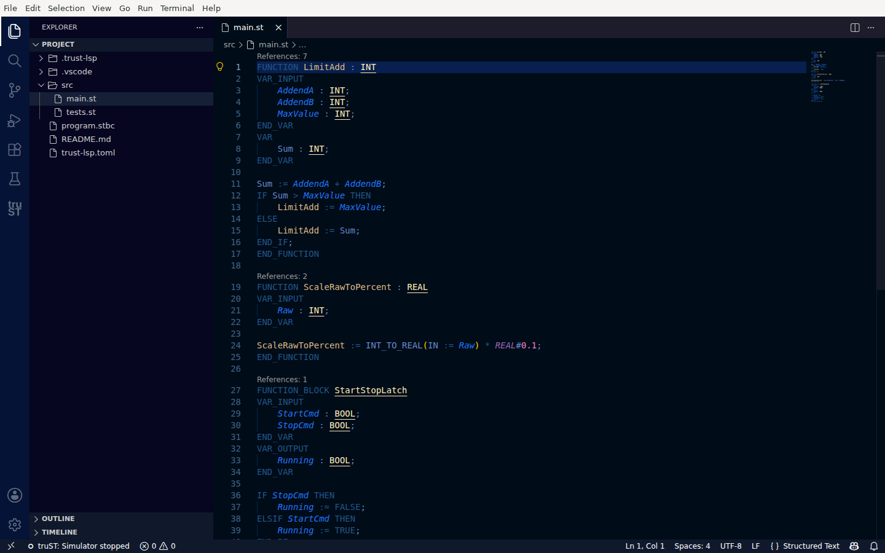
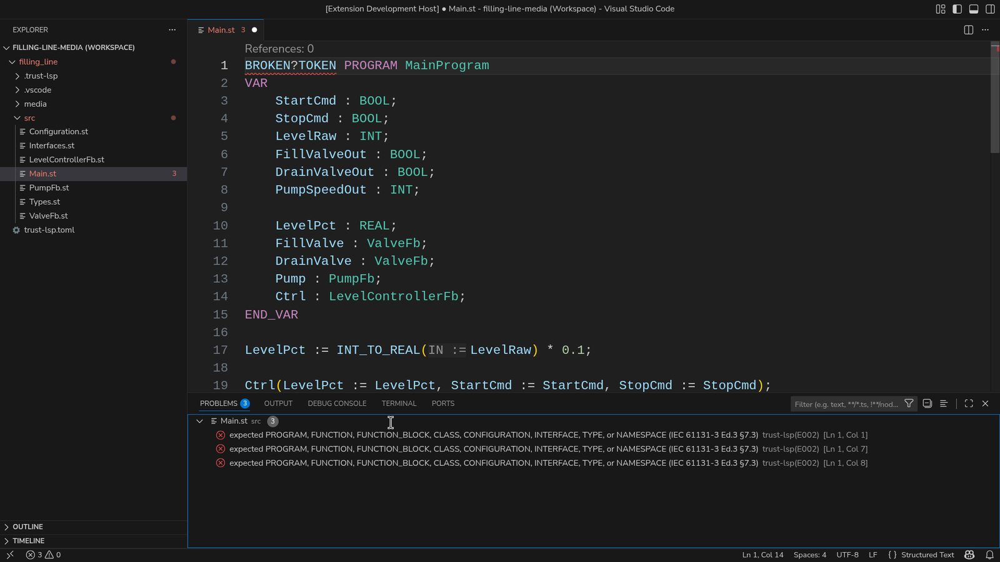
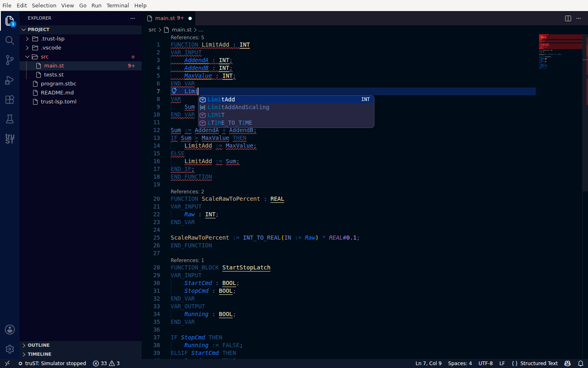
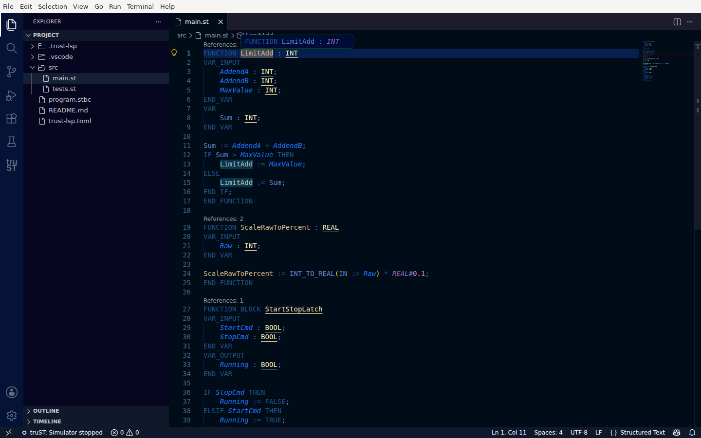
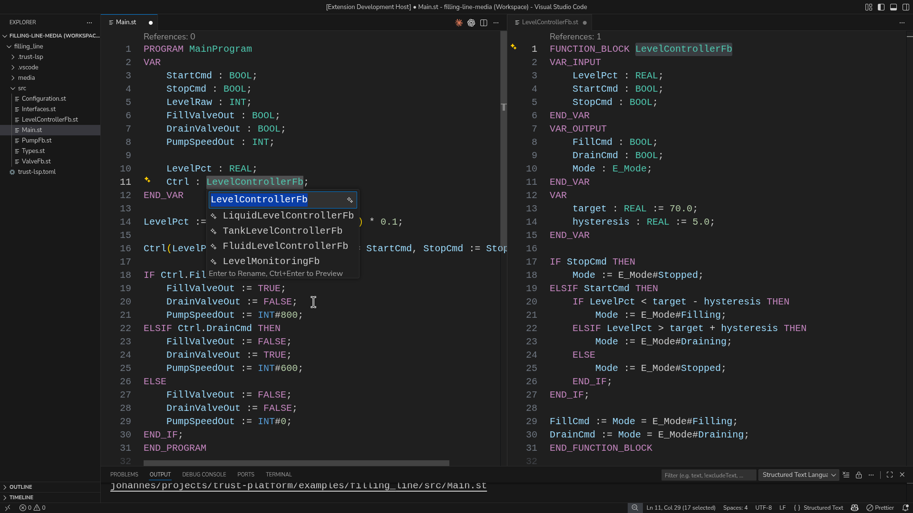

# Program In VS Code

This is the primary truST engineering workflow.

Start with the shipped tutorial project in desktop VS Code.



*Structured Text with full syntax highlighting and inline reference counts (CodeLens).*

## What You Get In One Window

- IEC-aware diagnostics and semantic highlighting
- go to definition, references, rename, and formatting
- **Live Values** with live I/O and memory (read + write/force)
- the debugger with breakpoints, stepping, locals, and call stack

## Use A Shipped Project First

Start with a shipped tutorial:

- `examples/tutorials/12_hmi_pid_process_dashboard`

Open it:

```bash
code examples/tutorials/12_hmi_pid_process_dashboard
```

## Quick Start

1. Install `truST LSP`.
2. Open the tutorial project in VS Code.
3. Open `src/main.st` and `src/config.st`.
4. Press **Start** on the Run card to run the program on the simulator (see [Run & Check](../operate/debugging-and-runtime-panel.md)).
5. Open **Live Values** to inspect `%I`, `%Q`, and memory while it runs (see [Live Values](../operate/live-values.md)).
6. Set a breakpoint in the control logic and step through it (see [Debugging In VS Code](../operate/debugging-in-vscode.md)).
7. Rename or jump to the control function block to confirm the LSP flow.
8. Open the **HMI** preview once the editor-side behavior makes sense.

## IEC-Aware Diagnostics



*Figure:* The Problems panel reports the IEC rule directly, so the editor tells
you what language rule was broken instead of only showing a generic parser
failure.

## Completion And Hover



*Context-aware completion from the language server — suggesting functions, function blocks, and standard library symbols as you type.*



*Hover shows the resolved signature; go-to-definition, references, and rename work the same way across files.*

## Debug Live

Set a breakpoint and step through your logic with VS Code's debugger — see
[Debugging In VS Code](../operate/debugging-in-vscode.md) for the full flow (breakpoints, current-line
highlight, Variables, and the Call Stack).

## Refactor Safely



*Figure:* Rename a Structured Text symbol across files from the editor and
preview the affected definition before you apply the change.

## Safe Signals In The Tutorial

The tutorial already maps safe proof signals:

- `%IX0.0` = `StartCmd`
- `%IX0.1` = `StopCmd`
- `%IX0.2` = `PressureSpikeCmd`
- `%IX0.3` = `BypassCmd`
- `%QX0.0` = `PumpRunning`
- `%QX0.1` = `HighPressureAlarm`
- `%QX0.4` = `BypassOpen`

Verify it works:

1. toggle `%IX0.0`
2. confirm **Live Values** changes
3. open the HMI from the running project for visual confirmation


*Figure:* `/hmi` for the same shipped tutorial project once the runtime is
connected. Use it as the operator-side confirmation after the editor,
diagnostics, Live Values, and debugger all look correct.

## If It Fails

- no commands in Command Palette: go to [Installation](installation.md)
- the program won't run or connect: go to
  [Run & Check](../operate/debugging-and-runtime-panel.md)
- values do not move: go to [I/O Binding](../connect/devices-and-fieldbus/io-binding.md)
- diagnostics appear after your edit: use the clickable Problems panel
- a realistic first failure is a one-letter typo such as `PumpRuning` instead of
  `PumpRunning`; click the Problems entry to jump straight to the bad line

## Next

- [Create A New Project](create-new-project.md)
- [Project Layout](../develop/project-layout.md)
- [Run & Check](../operate/debugging-and-runtime-panel.md)
- [HMI And Web UI](../operate/hmi-and-web-ui.md)
