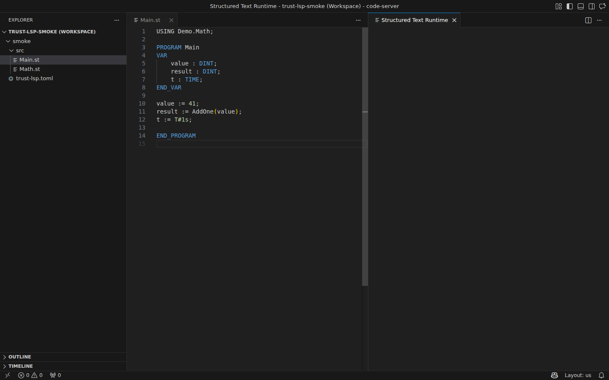

# Program In VS Code

Start with the shipped tutorial project in VS Code.

## Use A Shipped Project First

Start with a shipped tutorial:

- `examples/tutorials/12_hmi_pid_process_dashboard`

Open it:

```bash
code examples/tutorials/12_hmi_pid_process_dashboard
```



*Figure:* A code-server-backed VS Code workspace with `Main.st` rendered in the
editor. This is where diagnostics, runtime-panel commands, and project
navigation begin.

## Quick Start

1. Install `truST LSP`.
2. Open the tutorial project in VS Code.
3. Open `src/main.st` and `src/config.st`.
4. Run `Structured Text: Open Runtime Panel`.
5. Start the runtime in `Local` mode.
6. Inspect `%I` and `%Q` values in the runtime panel.
7. Change one safe line in `src/main.st`, save, and rerun.
8. If something breaks, open the Problems panel.

## What To Toggle

The tutorial already maps safe proof signals:

- `%IX0.0` = `StartCmd`
- `%IX0.1` = `StopCmd`
- `%IX0.2` = `PressureSpikeCmd`
- `%IX0.3` = `BypassCmd`
- `%QX0.0` = `PumpRunning`
- `%QX0.1` = `HighPressureAlarm`
- `%QX0.4` = `BypassOpen`

Verify it works:

1. toggle `%IX0.0`
2. confirm the runtime panel changes
3. open `/hmi` from the running project for visual confirmation


*Figure:* `/hmi` for the shipped tutorial project once the runtime is connected.
Use it as the operator UI you can open after toggling `%IX0.0` in the runtime
panel.

## If It Fails

- no commands in Command Palette: go to [Installation](installation.md)
- runtime panel does not connect: go to
  [Debugging And Runtime Panel](../operate/debugging-and-runtime-panel.md)
- values do not move: go to [I/O Binding](../connect/devices-and-fieldbus/io-binding.md)
- diagnostics appear after your edit: use the clickable Problems panel
- a realistic first failure is a one-letter typo such as `PumpRuning` instead of
  `PumpRunning`; click the Problems entry to jump straight to the bad line

## Next

- [Create A New Project](create-new-project.md)
- [Project Layout](../develop/project-layout.md)
- [Debugging And Runtime Panel](../operate/debugging-and-runtime-panel.md)
- [HMI And Web UI](../operate/hmi-and-web-ui.md)
